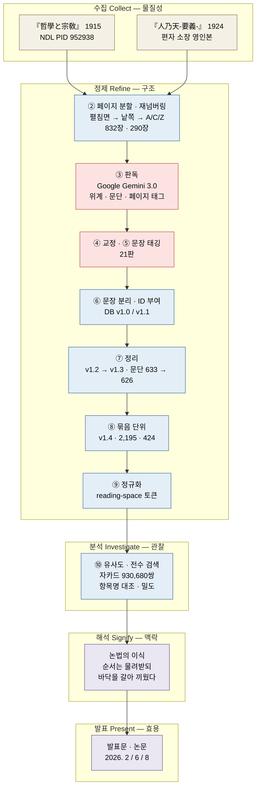

# phenomenal-realism-kr

이노우에 데쓰지로 井上哲次郞, 『哲學と宗敎』(1915)와 이돈화 李敦化, 『人乃天-要義-』(1924)의
전문(全文) 코퍼스, **원본에서 분석 텍스트에 이르는 가공 절차 전 과정**, 그리고 두 책의 관계를
디지털 문헌학으로 분석한 연구의 자료와 산출물.

편자: 허수(서울대학교 역사학부) · [hs-kmhistory.com](https://hs-kmhistory.com)

> *A full-text corpus of Inoue Tetsujirō's* Philosophy and Religion *(1915) and Yi Don-hwa's*
> The Essentials of Innaecheon *(1924), with the complete digitization and normalization
> pipeline. Documentation is in Korean.*

---

## 이 저장소가 있는 이유

두 책의 관계를 계량으로 다루는 연구에서, 결과보다 먼저 검증되어야 할 것은 **자료가 어떻게
만들어졌는가**다. 어떤 스캔본을 썼는지, 무엇으로 판독했는지, 몇 번을 고쳤는지, 무엇을 한
단어로 셌는지에 따라 뒤의 모든 수치가 달라진다.

그래서 이 저장소는 최종 데이터만이 아니라 **중간 판(revision)을 모두** 싣는다. 교정의 내력이
서술이 아니라 파일의 차이로 드러나게 하기 위해서다.

**AI가 어느 단계에서 무엇을 했는지도 밝힌다**([`docs/06_ai_disclosure.md`](docs/06_ai_disclosure.md)).
두 책의 판독은 기계 OCR이 아니라 멀티모달 언어모델이 했고, 장·절·항의 위계 인식도 거기서
나왔다. 이 사실을 밝히지 않으면 자료의 성격을 오해하게 된다.

---

## 자료

| | 『哲學と宗敎』 | 『人乃天-要義-』 |
|---|---|---|
| 저자 | 井上哲次郞 | 李敦化 |
| 발행 | 東京: 弘道館, 1915. 2. 12. | 京城: 天道敎中央宗理院布德課, 1924. 3. 30. |
| 구성 | 29장(序 1 · 본론 26 · 附錄 2) | 6장 |
| 문단 | 626 | 365 |
| 문장 | 10,976 | 2,108 |
| 글자(공백 제외) | 381,049 | 94,671 |
| 저본 | NDL 디지털컬렉션 [PID 952938](https://dl.ndl.go.jp/pid/952938) | 편자 소장 영인본 촬영 (三版, 1928로 봄) |

**판권지 실측.** 두 책 모두 판권지를 직접 판독해 서지를 확정했다. 상세는
[`docs/01_sources.md`](docs/01_sources.md).

- **1915** — 大正4년 2월 9일 인쇄, 2월 12일 발행. 著作者 井上哲次郞(東京市 神田區 北神保町
  十一番地) · 發行者 辻本卯藏 · 印刷所 日淸印刷株式會社 · 發行所 弘道館 · 正價 金貳圓 · 複製不許.
- **1924** — 初版 大正13년 3월 30일 · 再版 大正14년 2월 20일 · 三版 昭和3년 1월 23일.
  著作兼發行人 李敦化(京城府 慶雲洞 八八番地) · 印刷人 李斗星 · 印刷所 大東印刷株式會社 ·
  發行所 天道敎中央宗理院布德課(같은 慶雲洞 八八) · 改正定價 五十錢.

⚠️ **발행처 표기의 정정.** 선행연구는 1924년 책의 발행처를 「開闢社」로 적은 곳과
「天道敎中央宗理院布德課」로 적은 곳이 갈린다. **판권지는 후자를 지지한다.**

---

## 구성

```
├── docs/
│   ├── 01_sources.md          원사료 서지 — 판권지 실측 · 저본 · 소장
│   ├── 02_digitization.md     원본 → 페이지 분할 → 판독 → 교정 → DB
│   ├── 03_db_structure.md     스키마 · ID 체계 · line_class · 버전 이력
│   ├── 04_normalization.md    토큰화 · 정규화 · stoplist
│   ├── 05_similarity.md       자카드 — 정의 · 단위 · 문턱 · 층위별 값
│   ├── 06_ai_disclosure.md    어느 단계에 무슨 모델이 무엇을 했는가
│   ├── analysis-notes/        분석 노트 20편
│   └── analysis-reports/      종합 보고서 4편
├── data/
│   ├── 1_raw_data/            원본 PDF (1915년 것은 용량 초과로 미포함 — IMAGES.md)
│   ├── 2_cut_renumbering/     페이지 이미지 1,122장 (832 + 290)
│   ├── 3_corpus/              판독 텍스트와 DB — 판별 보존
│   ├── 4_tokens/              정규화 토큰
│   └── analysis/              유사도 산출물
├── scripts/                   재현 코드
├── app/                       Streamlit 발표용 앱
└── IMAGES.md                  1915년 원본 PDF의 소재와 재현 방법
```

각 폴더가 어느 단계의 산출물인지는 아래 「가공 절차」의 표에 있다.

---

## 가공 절차 — 한눈에




<sub>■ 붉은 칸은 **언어모델이 개입한 단계**로 결정론적이지 않다. 그래서 산출물을 판별로 모두
실었다. ■ 푸른 칸은 **규칙 기반**이며 코드로 재현된다. ■ 보라 칸은 사람의 판단이다.</sub>

바깥의 다섯 묶음은 편자가 쓰는 연구 단계 틀이다 — **수집 Collect · 정제 Refine · 분석
Investigate · 해석 Signify · 발표 Present.** 물질성 → 구조 → 관찰 → 맥락 → 효용으로 올라간다.

### 이 저장소가 덮는 자리

| 단계 | 이 저장소 | 어디에 |
|---|---|---|
| **수집** | ✅ 저본의 출처와 서지 | `docs/01` · `IMAGES.md` |
| **정제** | ✅ **거의 전부가 여기다** — ②~⑨ 여덟 단계 | `docs/02·03·04` · `data/` · `scripts/` |
| **분석** | ✅ 산출물과 절차 | `docs/05` · `data/analysis/` · `images/` |
| **해석** | ✖ 발표문·논문의 몫 | — |
| **발표** | ✖ 발표문·논문의 몫 | 아래 「인용」 |

**열 단계 가운데 여덟이 정제다.** 원본에서 분석 가능한 텍스트를 만드는 일이 이 연구에서
차지하는 몫이 그만큼 크고, 그런데도 논문에는 각주 한 줄로 줄어든다. **이 저장소는 그 여덟을
펴 놓은 것이다.**

해석과 발표는 여기 없다. 두 책을 맞대 무엇을 읽어 냈는지는 인용 절의 발표문들에 있다.

### 단계별 — 자료 · 문서 · 코드

| 단계&nbsp;&nbsp;&nbsp;&nbsp;&nbsp;&nbsp;&nbsp;&nbsp;&nbsp;&nbsp;&nbsp;&nbsp;&nbsp;&nbsp;&nbsp;&nbsp;&nbsp;&nbsp;&nbsp;&nbsp; | 산출물 | 문서 | 코드 |
|---|---|---|---|
| **①&nbsp;저본&nbsp;확보** | `data/1_raw_data/` · [`IMAGES.md`](IMAGES.md) | [01 원사료](docs/01_sources.md) | — |
| **②&nbsp;페이지&nbsp;분할·재넘버링** | `data/2_cut_renumbering/` | [02 §②](docs/02_digitization.md) · [03 §5-2](docs/03_db_structure.md) | `scripts/01_page_split/` |
| **③&nbsp;판독** | `data/3_corpus/*.txt` | [02 §③](docs/02_digitization.md) · [06 AI 고지](docs/06_ai_disclosure.md) | — |
| **④⑤&nbsp;교정·문장&nbsp;태깅** | `data/3_corpus/revisions/` | [02 §④⑤](docs/02_digitization.md) | `n8n_code_node.txt` (명세) |
| **⑥&nbsp;문장&nbsp;분리·ID&nbsp;부여** | `data/3_corpus/*_v1.0/v1.1.xlsx` | [03 DB 구조](docs/03_db_structure.md) | `scripts/04_build_db/` |
| **⑦&nbsp;정리** | `*_v1.2/v1.3.xlsx` | [03 §2 버전 이력](docs/03_db_structure.md) | — |
| **⑧&nbsp;묶음&nbsp;단위&nbsp;부여** | `*_v1.4.xlsx` | [03 §6 묶음 ID](docs/03_db_structure.md) | — |
| **⑨&nbsp;정규화** | `data/4_tokens/` | [04 정규화](docs/04_normalization.md) · `docs/normalization_spec_2026-05-21.md` | `scripts/02_normalize/` |
| **⑩&nbsp;유사도&nbsp;산출** | `data/analysis/` · `images/` | [05 유사도](docs/05_similarity.md) | `scripts/03_similarity/` · `scripts/figures/` |

### 어디부터 읽을 것인가

- **자료를 쓰려는 사람** → [01 원사료](docs/01_sources.md) → [03 DB 구조](docs/03_db_structure.md)
- **수치를 재현하려는 사람** → [04 정규화](docs/04_normalization.md) → [05 유사도](docs/05_similarity.md)
- **판독의 신뢰도가 궁금한 사람** → [06 AI 사용 고지](docs/06_ai_disclosure.md) → [02 디지털화](docs/02_digitization.md)

### 중간 판을 남기는 이유

`data/3_corpus/revisions/`에 교정 판이 모두 있다. 「일곱 번 고쳤다」는 서술보다 **판 사이의
차이를 직접 보는 편**이 정확하다. ③④⑤ 단계는 언어모델이 개입해 결정론적이지 않으므로,
**재현이 아니라 보존으로 검증 가능성을 확보했다.**

⚠️ **v1.2는 유실됐다.** v1.1과 v1.3을 대조하면 재현된다(장 번호 재배열 + 빈 `kr_text` 79행
삭제).

---

## 문단 수가 두 값으로 나오는 이유

1915년 책의 문단 수가 **633**과 **626** 두 값으로 나온다. 오기가 아니다.

- **633** — v1.1 기준. 판독이 잡아낸 문단 구획 전부.
- **626** — v1.3 이후. 빈 `kr_text` 79행을 지우면서 **텍스트가 없던 문단 일곱이 함께 사라졌다.**

1924년 책도 **366**과 **365**가 나온다. `P` 단위 식별자는 366개이고, 그중 본문
(`line_class = TEXT`)만 세면 365다.

**어느 버전으로 산출한 수치인지 반드시 밝혀야 한다.** 이 저장소가 DB를 버전별로 모두 싣는
까닭이다.

---

## 산출물의 시기 구분

`data/analysis/`의 유사도 산출물은 **비교 단위와 문턱이 다른 두 시기**로 나뉜다.

| | 단위 | 쌍 | 문턱 | 노이즈 처리 |
|---|---|---|---|---|
| 2026-02 | 문단 | 626 × 365 = 228,490 | 0.1 | 손으로 걸러 135쌍 → 111쌍 |
| 2026-05 이후 | 다섯 문장 묶음 | 2,195 × 424 = 930,680 * | 0.08 | 바닥 없음 |

\* 정규화 뒤 남는 한자어가 없는 묶음 다섯을 빼면 **2,190 × 424 = 928,560**이 된다. 그림과
산출물에 두 값이 함께 나오는 까닭이며, 비율에 미치는 영향은 미미하다
([`docs/05_similarity.md`](docs/05_similarity.md) §2-1).

**앞 시기 산출물을 지우지 않는다.** 방법이 바뀐 내력 자체가 기록이기 때문이다. 다만 어느 시기의
것인지 폴더로 갈라 둔다. 상세는 [`docs/05_similarity.md`](docs/05_similarity.md).

---

## AI 사용 고지

| 단계 | 무엇이 | 무엇을 |
|---|---|---|
| ③ 판독 | **Google Gemini 3.0** | 전문 판독 + 장·절·항 위계 인식 + 문단 구분 |
| ④⑤ 교정·태깅 | 기록 없음 | 판은 모두 보존되어 있으나 무엇이 개입했는지 미상 |
| 분석 스크립트 | Claude Code | 코드 작성 |

**언어모델의 오독은 깨진 글자가 아니라 문맥에 맞는 다른 글자로 나타난다.** 곧 이 코퍼스의 오류는
읽히는 오류일 가능성이 높다. 중요한 인용은 원본 이미지와 대조하기를 권한다. 상세와 권고는
[`docs/06_ai_disclosure.md`](docs/06_ai_disclosure.md).

---

## 알려진 한계

1. **원본 이미지와의 전면 대조를 하지 않았다.** 판독 결과는 교정을 거쳤으나 전수 대조는 아니다.
2. **문장 분리의 근거가 두 책에서 다르다.** 1915년 책은 일본어 구두점 기반이고, 1924년 책은
   국한문 혼용에 마침표가 드물어 **판독 단계에서 문장 경계를 태그로 명시**했다. 문장 수를 단위로
   삼는 비교는 이 비대칭을 고려해야 한다.
3. **구조 표시의 전수 대조는 하지 않았다.** 1924년 책의 항 제목 대괄호와 페이지 태그(1915년
   기준 804개)는 원문 대조로 대응 방식을 확인했으나, 개별 자리를 하나하나 맞춘 것은 아니다.
   쪽수를 다루는 인용은 원본 이미지를 함께 보기를 권한다.
4. **교정 판 사이의 차이를 대조하지 않았다.** 파일명이 가리키는 바는 추정이다.

---

## 라이선스

| 대상 | 라이선스 |
|---|---|
| 데이터 (`data/`) | [CC BY 4.0](https://creativecommons.org/licenses/by/4.0/deed.ko) |
| 문서 (`docs/`, `README.md`) | [CC BY 4.0](https://creativecommons.org/licenses/by/4.0/deed.ko) |
| 코드 (`scripts/`, `app/`) | [MIT](LICENSE-MIT) |

> **원저작물에는 어떤 제약도 더하지 않는다.** 『哲學と宗敎』(1915)와 『人乃天-要義-』(1924)의
> 본문은 저작권 보호기간이 만료된 퍼블릭 도메인 저작물이다. 위 CC BY 4.0은 **전사·교정·
> 구조화·정규화의 결과물**에만 적용된다.

1915년 저본은 일본 국립국회도서관 디지털컬렉션의 저작권 만료 자료로, NDL 방침에 따라 허락 없이
이용·전재할 수 있다. 1924년 저본은 편자 소장 영인본을 직접 촬영한 것이다.

---

## 인용

```
허수, phenomenal-realism-kr: 『哲學と宗敎』(1915)·『人乃天-要義-』(1924) 코퍼스와 가공 절차,
2026. https://github.com/hursoo/phenomenal-realism-kr
```

이 코퍼스를 쓴 연구는 다음과 같다.

- 허수, 「디지털문헌학으로 본 20세기 초 현상즉실재론의 한국 유입 — 『철학과 종교』에 대한
  이돈화의 취사선택을 중심으로」, 학술회의 「현상즉실재론의 전유와 한국적 세계관의 모색」
  (서울대학교 인문학연구원 · 미래기초학문분야 기반조성사업), 2026. 2. 11.
- 허수, 「이돈화의 현상즉실재론 전유, 개념에서 논법으로 — 이노우에의 유물론 반박은 어떻게
  인내천 논증이 되었는가」, 한국역사연구회 개념사연구반 발표문, 2026. 8. 21.
- 허수, 「인내천 논증을 통한 이돈화의 현상즉실재론 전유 — 디지털 문헌학으로 본 매개 경로와
  번안 양상」, 세미나반 내부발표, 2026. 6. 12.

발표 자리와 일정은 편자의 홈페이지에도 정리되어 있다 —
[hs-kmhistory.com](https://hs-kmhistory.com/activities/).

## 관련 저장소

- [`hursoo/digital-philology`](https://github.com/hursoo/digital-philology) — 2026년 1월
  내부발표용 앱과 그 시점의 자료. 당시 공개본은 DB v1.1 기준이며, **이 저장소가 그것을
  이어받는다.**
