# 도식 색인

두 책에 실린 도식 **15개**의 목록이다. DB에서 `line_class = FIGURE`인 행에 대응하며,
각 행의 `figure_path`가 아래 이미지를 가리킨다.

⚠️ **쪽 전체 이미지이며 도식만 잘라낸 것이 아니다.** 앞뒤 본문이 함께 보인다.

| 열 | 뜻 |
|---|---|
| `uid` | DB의 전역 고유 식별자. **이것으로 행을 특정한다** |
| `local_id` | 계층 위치. 1924년 도식은 `ANNO`로 겹치므로 `uid`를 쓴다 |
| `structure_id` | 도식이 속한 장·절·항 |

---

## 1915 · 31쪽 — `Inoue_Relation_01`

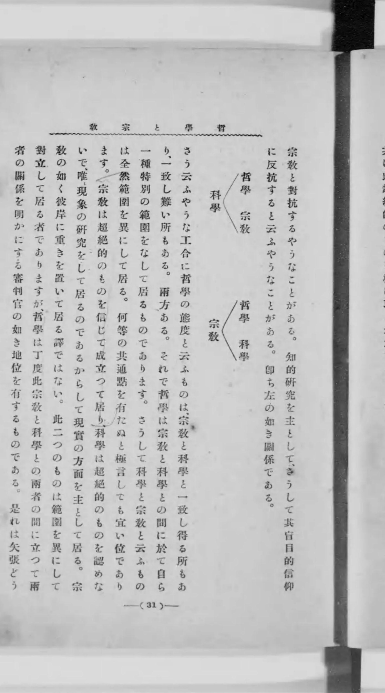

| | |
|---|---|
| 유형 | Triangle |
| `uid` | `BK_IT_1915_PR_00379` |
| `local_id` | `C01-S03-P08-S01` |
| `structure_id` | `C01-S03` |
| 앞 문장 | 即ち左の如き關係である。 |

## 1915 · 37쪽 — `Inoue_Dualism_List`

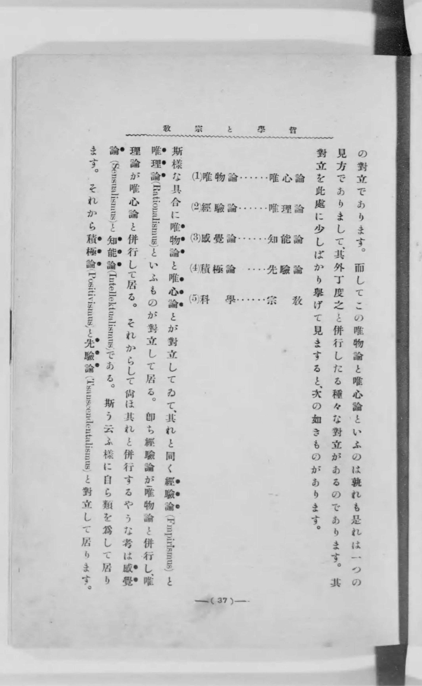

| | |
|---|---|
| 유형 | Opposite_Pairs |
| `uid` | `BK_IT_1915_PR_00433` |
| `local_id` | `C02-P03-S01` |
| `structure_id` | `C02` |
| 앞 문장 | 其對立を此處に少しばかり擧げて見ますると、次の如きものがあります。 |

## 1915 · 66쪽 — `Inoue_Metaphysics_01`

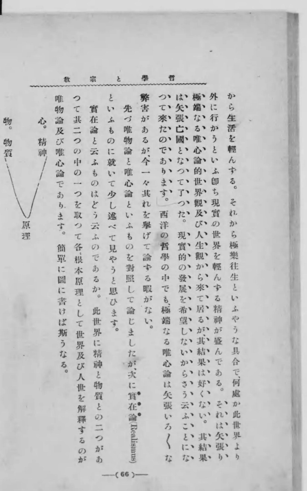

| | |
|---|---|
| 유형 | Trialism |
| `uid` | `BK_IT_1915_PR_00855` |
| `local_id` | `C02-P31-S01` |
| `structure_id` | `C02` |
| 도식 안의 글자 | 精神 |
| 앞 문장 | 簡單に圖に書けば斯うなる。 |

## 1915 · 74쪽 — `Inoue_Phenomenon_Reality_01`

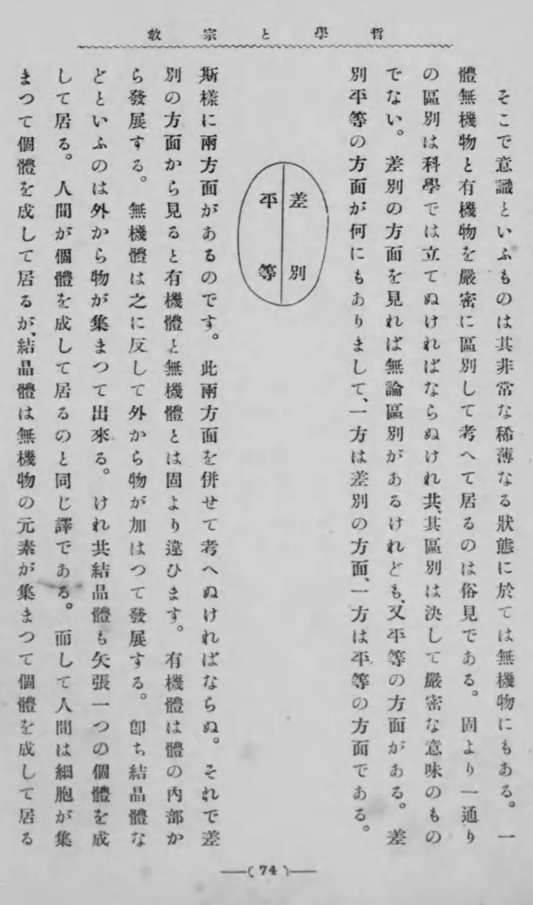

| | |
|---|---|
| 유형 | Binary_Opposition |
| `uid` | `BK_IT_1915_PR_00971` |
| `local_id` | `C02-P38-S01` |
| `structure_id` | `C02` |
| 도식 안의 글자 | 差別 |
| 앞 문장 | 差別平等の方面が何にもありまして、一方は差別の方面、一方は平等の方面である。 |

## 1915 · 120쪽 — `Inoue_Will_Flow`

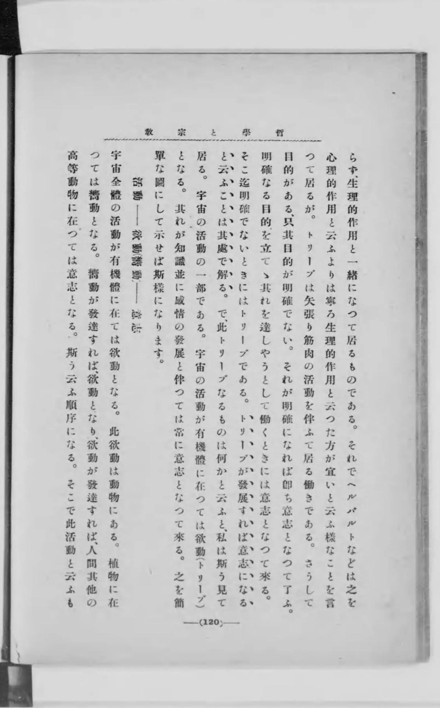

| | |
|---|---|
| 유형 | Flow_Chart |
| `uid` | `BK_IT_1915_PR_01542` |
| `local_id` | `C03-P20-S01` |
| `structure_id` | `C03` |
| 도식 안의 글자 | 活動 - 欲動（衝動） - 意志 |
| 앞 문장 | 之を簡單な圖にして示せば斯樣になります。 |

## 1915 · 132쪽 — `Inoue_Vision_Circle`

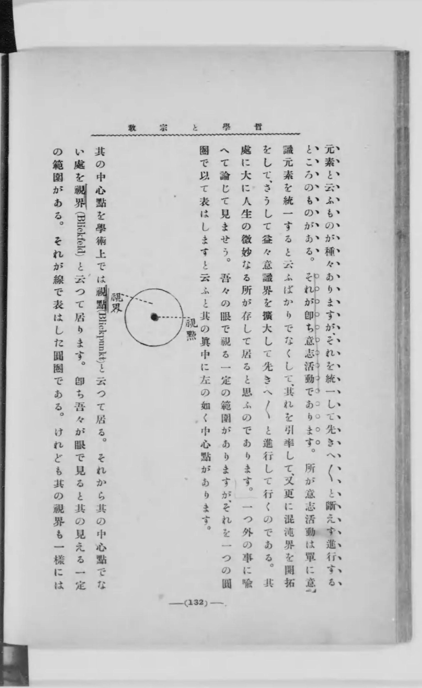

| | |
|---|---|
| 유형 | Geometric_Diagram |
| `uid` | `BK_IT_1915_PR_01720` |
| `local_id` | `C04-P05-S01` |
| `structure_id` | `C04` |
| 도식 안의 글자 | 視點 |
| 앞 문장 | 吾々の眼で視る一定の範圍がありますが、それを一つの圓圈で以て表はしますと云ふと其の眞中に左の如く中心點があります。 |

## 1915 · 136쪽 — `Inoue_Consciousness_Halo`

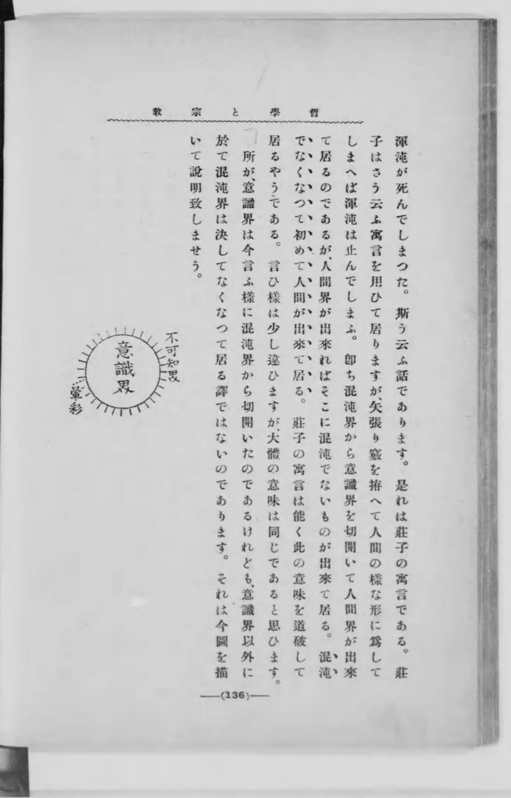

| | |
|---|---|
| 유형 | Consciousness_Map |
| `uid` | `BK_IT_1915_PR_01801` |
| `local_id` | `C04-P12-S01` |
| `structure_id` | `C04` |
| 도식 안의 글자 | 不可知界 - 意識界 - 暈彩 |
| 앞 문장 | それは今圖を描いて説明致しませう。 |

## 1915 · 162쪽 — `Inoue_Path_Choice`

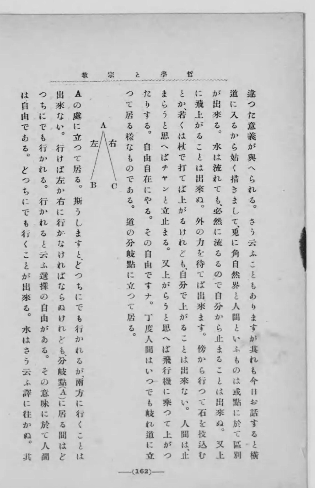

| | |
|---|---|
| 유형 | Bifurcation_Chart |
| `uid` | `BK_IT_1915_PR_02207` |
| `local_id` | `C04-P28-S01` |
| `structure_id` | `C04` |
| 도식 안의 글자 | A - 左 - B |
| 앞 문장 | 道の分岐點に立つて居る。 |

## 1915 · 183쪽 — `Inoue_Linear_Progress`

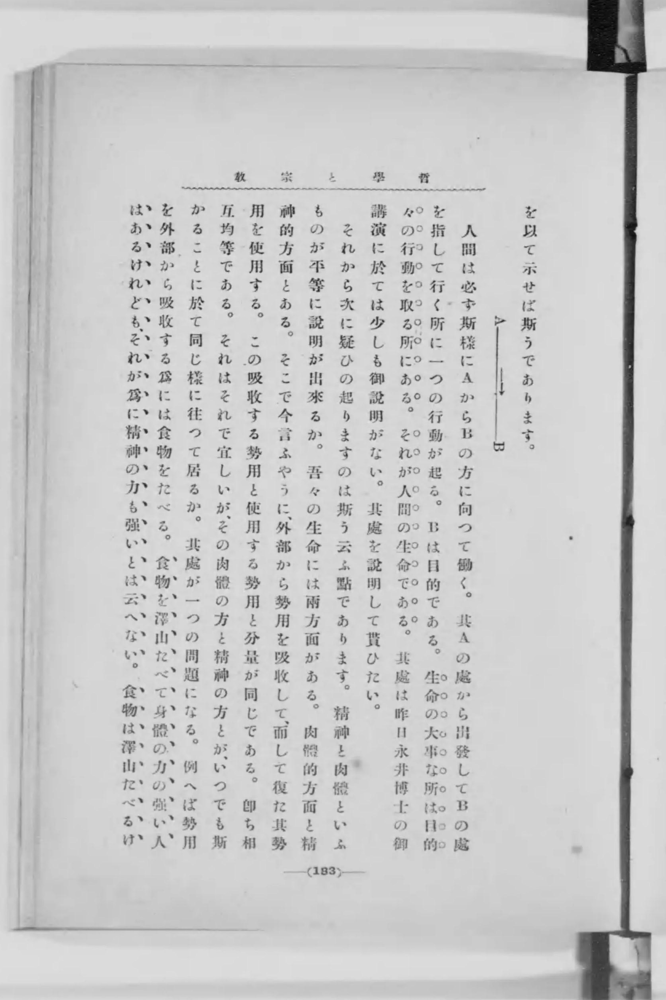

| | |
|---|---|
| 유형 | Linear_Vector |
| `uid` | `BK_IT_1915_PR_02509` |
| `local_id` | `C05-P12-S01` |
| `structure_id` | `C05` |
| 도식 안의 글자 | A ----> B |
| 앞 문장 | 簡單な圖を以て示せば斯うであります。 |

## 1915 · 567쪽 — `Inoue_Consciousness_Comparison`

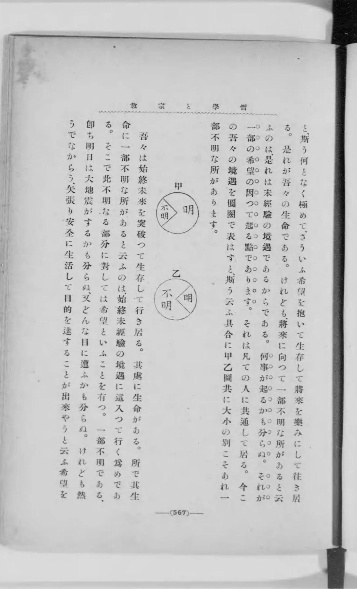

| | |
|---|---|
| 유형 | Contrast_Diagram |
| `uid` | `BK_IT_1915_PR_07797` |
| `local_id` | `C21-P10-S01` |
| `structure_id` | `C21` |
| 도식 안의 글자 | [甲] 明 不明 |
| 앞 문장 | 今この吾々の境遇を圓圈で表はすと、斯う云ふ具合に甲乙圖共に大小の別こそあれ一部不明な所があります。 |

## 1915 · 660쪽 — `Inoue_Mandala_Synthesis`

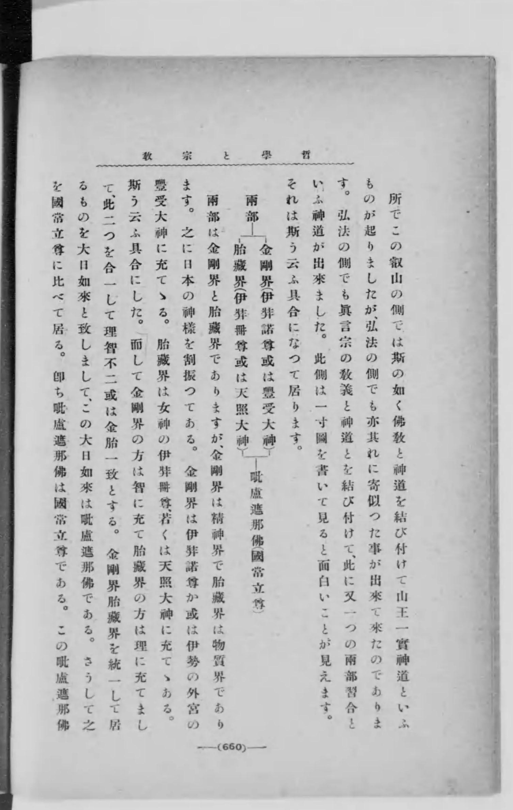

| | |
|---|---|
| 유형 | Convergence_Diagram |
| `uid` | `BK_IT_1915_PR_09096` |
| `local_id` | `C25-P10-S01` |
| `structure_id` | `C25` |
| 도식 안의 글자 | 兩部 - 金剛界(伊弉諾尊或は豐受大神) / 胎藏界(伊弉册尊或は天照大神) - 毗盧遮那佛(國常立尊) |
| 앞 문장 | それは斯う云ふ具合になつて居ります。 |

## 1924 · 96쪽 — `Yi_Relation_01`

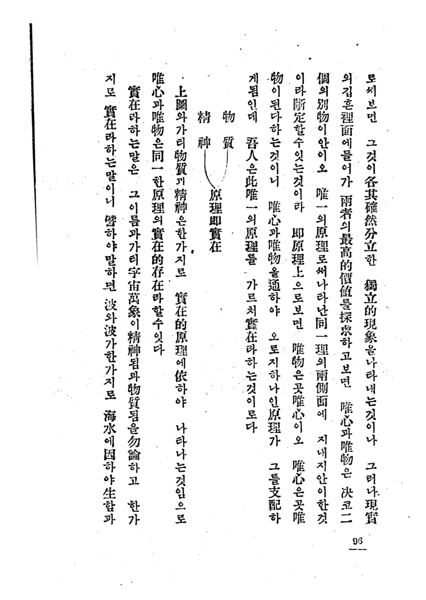

| | |
|---|---|
| 유형 | Triangle |
| `uid` | `BK_YD_1924_IY_00706` |
| `local_id` | `ANNO` |
| `structure_id` | `C03-S04-I02` |
| 도식 안의 글자 | 物質 — 原理即實在 — 精神 |
| 앞 문장 | 即 原理上으로 보면 唯物은 곳 唯心이오 唯心은 곳 唯物이 된다 하는 것이니 唯心과 唯物을 通하야 오로지 하나인 原理가 그를 支配하게 됨인데 吾人은 此唯一의 原理를 가르쳐 實在라 하는 것이로다 |

## 1924 · 99쪽 — `Yi_Time_Circle_01`

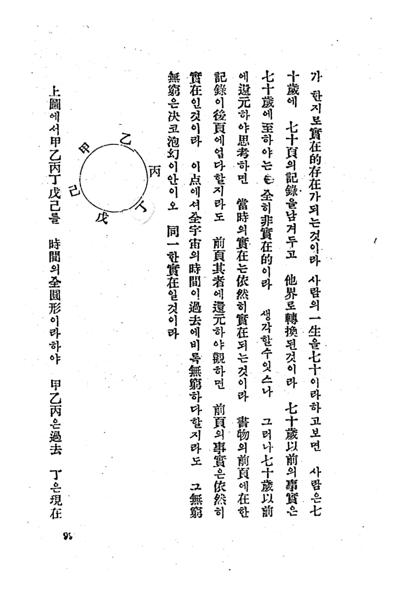

| | |
|---|---|
| 유형 | Circle |
| `uid` | `BK_YD_1924_IY_00729` |
| `local_id` | `ANNO` |
| `structure_id` | `C03-S04-I02` |
| 도식 안의 글자 | 甲, 乙, 丙, 丁, 戊, 己 |
| 앞 문장 | 이 點에셔 全宇宙의 時間이 過去에 비록 無窮하다 할지라도 그 無窮은 決코 泡幻이 안이오 同一한 實在일 것이라 |

## 1924 · 122쪽 — `Yi_Knowledge_Realm_01`

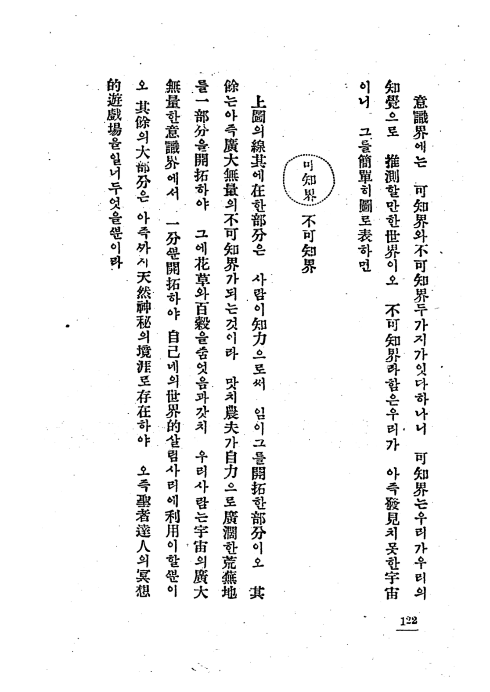

| | |
|---|---|
| 유형 | Circle_Boundary |
| `uid` | `BK_YD_1924_IY_00912` |
| `local_id` | `ANNO` |
| `structure_id` | `C03-S04-I05` |
| 도식 안의 글자 | 可知界 (내부), 不可知界 (외부) |
| 앞 문장 | 그를 簡單히 圖로 表하면 |

## 1924 · 123쪽 — `Yi_Consciousness_Evolution_01`

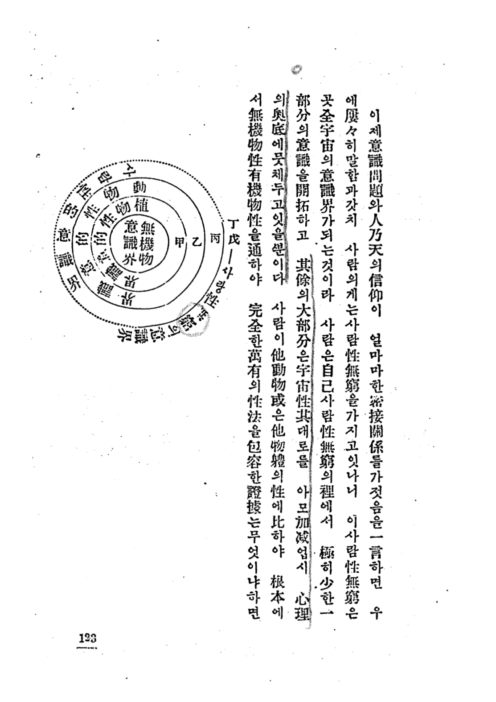

| | |
|---|---|
| 유형 | Concentric_Circles |
| `uid` | `BK_YD_1924_IY_00923` |
| `local_id` | `ANNO` |
| `structure_id` | `C03-S04-I05` |
| 도식 안의 글자 | (Center) 無機物 意識界, (甲) 植物性 意識界, (乙) 動物性 意識界, (丙) 社會的 意識界, (丁戊) 사람性 無窮의 意識界 |
| 앞 문장 | 사람이 他動物 或은 他物體의 性에 比하야 根本에서 無機物性 有機物性을 通하야 完全한 萬有의 性法을 包容한 證據는 무엇이냐 하면 |

