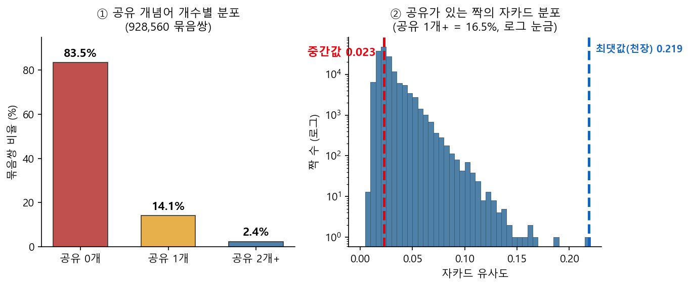
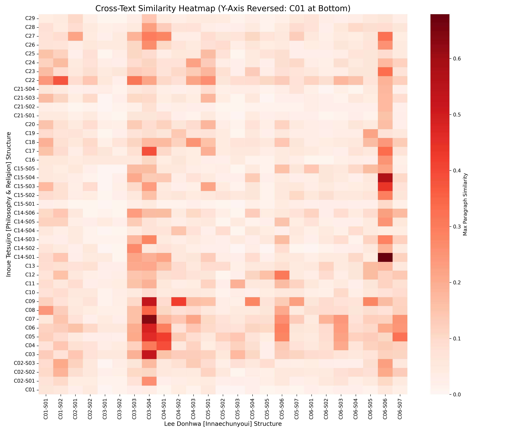
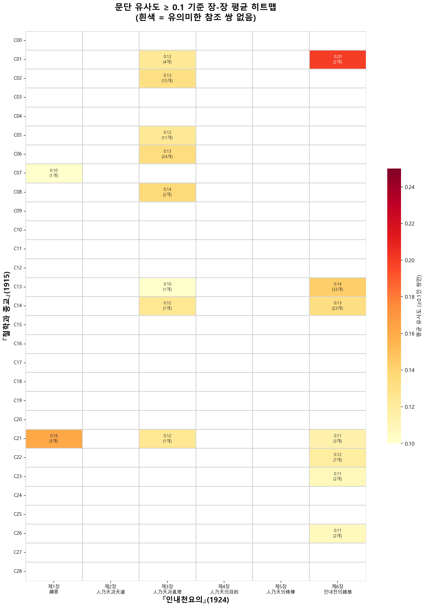

# 05. 유사도

두 책이 얼마나 닮았는지를 재는 방법과, 그 결과를 읽는 법이다.

**한 문장으로 요약하면 이렇다 — 평균적으로는 거의 닮지 않았고, 부분적으로 닮은 대목이 있다.**
이 연구가 다루는 것은 그 부분이다.

---

## 1. 자카드 유사도

두 집합이 얼마나 겹치는지를 재는 지표다.

```
J(A, B) = |A ∩ B| / |A ∪ B|
```

0이면 공통 원소가 하나도 없고, 1이면 완전히 같다. 여기서 A와 B는 **한 단위 안에 나오는 한자어의
집합**이다.

**빈도는 세지 않는다.** 한 단위에 「實在」가 열 번 나와도 한 번 나온 것과 같이 다룬다. 집합이지
목록이 아니다.

### 왜 자카드인가

**첫째, 언어의 장벽을 넘는다.** 일본어와 국한문 혼용은 문법과 조사가 다르지만 **한자어라는 공통
의미 단위**를 공유한다. 문장을 해체해 한자어 집합으로 바꾸면 언어 차이를 넘어 개념의 겹침을 직접
잴 수 있다. 이 변환이 실제로 어떻게 이루어지는지는 [`04_normalization.md`](04_normalization.md).

**둘째, 분량 차이를 보정한다.** 1915년 책이 1924년 책보다 약 4배 크다. 합집합으로 나누므로 큰
쪽이 자동으로 유리해지지 않는다.

**셋째, 순서에 매이지 않는다.** 문맥의 순서와 무관하게 어떤 낱말이 함께 나오는가만 따지므로,
같은 주제를 다루고 있는지를 판단하는 데 적합하다.

### 자카드가 못 하는 것

- **의미를 모른다.** 같은 낱말이라도 용법이 다를 수 있다.
- **문맥을 모른다.** 낱말이 어떤 논리 안에 놓였는지는 잡히지 않는다.
- **원인을 말하지 않는다.** 겹침은 직접 영향에서 올 수도, 공통 출처에서 올 수도, 시대의 공통
  어휘에서 올 수도 있다. **수치만으로 「참조했다」를 말할 수 없다.**

세 번째가 가장 중요하다. 이 코퍼스의 수치는 **어디를 들여다볼지 가리킬 뿐이고, 무슨 일이
일어났는지는 그 자리의 원문을 읽어야 안다.**

---

## 2. 단위 — 무엇을 한 덩어리로 볼 것인가

자카드 값은 **무엇을 한 단위로 자르느냐에 따라 달라진다.** 같은 두 책에서 다음 값들이 나온다.

| 단위 | 쌍의 수 | 대표값 |
|---|---|---|
| 책 전체 | 1 | 0.0892 |
| 장 · 절 | 1,075 | 평균 0.0787 · 최대 0.6306 |
| 다섯 문장 묶음 | 930,680 | 84.0%가 0 · 최대 0.22 |
| 문단 (2026-02 시기) | 228,490 | 문턱 0.1 이상 135쌍 |

### 2-1. ⚠️ 묶음 쌍의 수가 두 값으로 나온다

**930,680**과 **928,560**이 함께 쓰인다. 오기가 아니다.

| 기준 | 묶음 | 쌍 | 공유 0인 비율 |
|---|---:|---:|---:|
| **구조 단위** — 잘린 묶음 전부 | 2,195 | **930,680** | 84.0% (표기 방식) |
| 빈 묶음 다섯 제외 | 2,190 | **928,560** | 83.9% (표기 방식) |
| 빈 묶음 제외 + 정규화 방식 | 2,190 | 928,560 | **83.5%** |

**정규화 뒤 남는 한자어가 하나도 없는 묶음이 다섯 있고, 모두 1915년 책 附錄 一에 있다.**
그 다섯이 930,680쌍 가운데 2,120쌍에 지나지 않으므로 비율은 거의 움직이지 않는다.

곧 **84.0% → 83.9%는 빈 묶음을 빼서 생긴 차이이고, 83.9% → 83.5%는 토큰화 방식을 바꿔서
생긴 차이다.** 앞엣것은 미미하고 뒤엣것이 실질이다.

이 저장소는 **구조 단위(2,195 · 930,680)를 기본으로 적되**, 그림과 산출물은 만들어진 시점의
기준을 그대로 둔다. 각 그림의 캡션과 §6의 표에 어느 기준인지 밝혀 두었다.

**이 값들은 서로 모순되지 않는다.** 단위를 크게 잡으면 어휘가 쌓여 겹침이 커지고, 잘게 잡으면
대부분의 쌍이 0이 된다. 당연한 일이다.

**중요한 것은 값이 아니라 분포의 모양이다.** 어느 단위에서 보아도 같다.



*그림 1. 다섯 문장 묶음 쌍의 자카드 분포. **928,560쌍 · 정규화 방식** 기준이다(아래 §2-1).*

**평균은 거의 0에 붙어 있고, 오른쪽으로 얇고 긴 꼬리가 있다.** 두 책은 대체로 다른 어휘를
쓰지만, 몇 자리에서는 눈에 띄게 겹친다.

**이 연구가 다루는 것은 그 꼬리다.** 평균이 낮다는 사실은 배경이고, 꼬리에 무엇이 있는지가
물음이다.

장/절 단위에서 최댓값 0.6306은 평균에서 **7.17 표준편차** 떨어진 자리이고 상위 0.19%에 든다.
분포의 오른쪽 끝이 얼마나 멀리 있는지를 보여 준다.

### 꼬리는 어디에 있는가

분포만으로는 「어딘가 닮은 자리가 있다」까지밖에 말하지 못한다. **그 자리가 어느 장의 어느
절인지**는 두 책을 격자로 놓고 보아야 한다.



*그림 2. 『철학과 종교』의 장·절(가로)과 『인내천요의』의 장·절(세로)을 맞댄 유사도 히트맵.
진한 칸이 겹침이 큰 자리다.*



*그림 3. 장 단위로 묶어 본 평균 유사도(문턱 이상만).*

**히트맵은 장·절 단위다.** 다섯 문장 묶음 단위로는 쌍이 93만 개라 격자로 그릴 수 없다. 곧 그림
1과 그림 2·3은 **단위가 다르며, 서로 대신하지 못하고 서로 보완한다** — 하나는 분포의 모양을,
다른 하나는 꼬리의 위치를 보인다.

---

## 3. 문턱

「닿았다」고 볼 최소 유사도를 정해야 한다. 시기에 따라 두 값을 썼다.

| 시기 | 단위 | 문턱 |
|---|---|---|
| 2026-02 | 문단 | 0.1 |
| 2026-05 이후 | 다섯 문장 묶음 | 0.08 |

**문턱은 임의의 선택이며, 그 임의성이 결론을 좌우해서는 안 된다.** 그래서 0.06 · 0.08 · 0.10 ·
0.12 네 값으로 다시 내어 확인했다. **절대값은 문턱에 따라 크게 달라지지만 장의 순위와 파트의
비는 네 문턱 모두에서 유지된다.**

---

## 4. 두 시기의 산출물

`data/analysis/`의 파일은 방법이 다른 두 시기로 나뉜다. **어느 시기의 것인지 확인하고 써야
한다.**

| | 2026-02 | 2026-05 이후 |
|---|---|---|
| 단위 | 문단 | 다섯 문장 묶음 |
| 쌍 | 626 × 365 = 228,490 | 2,195 × 424 = 930,680 |
| 문턱 | 0.1 | 0.08 |
| 토큰화 | 표기 방식(한자-only) | 정규화 방식이 정본 |
| 노이즈 처리 | **손으로 걸러 135쌍 → 111쌍** | **바닥 없음** |

### 노이즈 처리가 바뀐 이유

2026-02에는 문턱을 넘은 135쌍을 손으로 검토해 24쌍을 뺐다.

- **서수만 공유하는 쌍 7개** — 第一 · 第二 등만 일치
- **범용어만 공유하는 쌍 17개** — 如何 · 對照 · 區別 · 差異點 · 宇宙(단독) · 世界(단독) 등

남은 111쌍이 그때의 분석 대상이었다.

2026-05 이후에는 **바닥을 두지 않는다.** 공유 한자어가 하나뿐인 쌍도 덜어내지 않고 그대로 센다.
그런 쌍이 128,113개 있으며, 이들을 우연으로 보아 0으로 돌리면 「공유 0인 쌍의 비율」이 84.0%에서
97.8%로 오른다. 다만 파트별 밀도는 철학 37.4에서 37.0으로 내려갈 뿐이고 **장의 순위는 하나도
바뀌지 않는다.**

두 방침의 차이는 이렇게 정리된다.

| | 손 필터링 | 바닥 없음 |
|---|---|---|
| 장점 | 명백한 우연을 제거해 소수의 쌍을 정밀하게 본다 | 판단이 개입하지 않아 재현이 쉽다 |
| 단점 | 무엇을 「범용어」로 볼지에 판단이 든다 | 우연한 겹침이 섞인 채로 남는다 |

**앞 시기의 산출물을 지우지 않는다.** 방법이 바뀐 내력 자체가 기록이기 때문이다.

---

## 5. 수치를 읽을 때

1. **단위를 먼저 확인하라.** 단위 없는 자카드 값은 뜻이 없다.
2. **토큰화 방식을 확인하라.** 표기 방식과 정규화 방식의 값이 다르다
   ([`04_normalization.md`](04_normalization.md) §8).
3. **버전을 확인하라.** 문단 수가 633인지 626인지에 따라 쌍의 수가 달라진다
   ([`03_db_structure.md`](03_db_structure.md) §2).
4. **높은 값을 보면 원문을 읽어라.** 유사도는 자리를 가리킬 뿐이고, 그 자리에서 무슨 일이
   일어났는지는 수치가 말해 주지 않는다.

---

## 6. 산출물

### 수치

| 파일 | 내용 | 단위 |
|---|---|---|
| `crosstab_similarity_data.csv` | 장/절 교차표 원자료 (1,075셀) | 장·절 |
| `chapter_chapter_matrix*.csv` | 장-장 매트릭스 (평균·최대·건수) | 장 |
| `chapter_section_matrix*.csv` | 장-절 매트릭스 | 장·절 |
| `paragraph_similarity_top500.csv` | 문단 쌍 상위 500 | 문단 |
| `validated_pairs_final.csv` | 2026-02 검증 참조쌍 111개 | 문단 |
| `similarity_stats.json` | 분포 통계 | 장·절 |

### 그림

| 파일 | 내용 | 단위 | 시기 |
|---|---|---|---|
| `변1_자카드분포.png` | 자카드 분포 (그림 1) | 묶음 928,560쌍 · 정규화 방식 | 2026-05~ |
| `section_similarity_heatmap.png` | 장절별 유사도 히트맵 (그림 2) | 장·절 | 2026-02 |
| `chapter_heatmap_avg_above_threshold.png` | 장-장 평균 유사도 (그림 3) | 장 | 2026-02 |
| `similarity_spectrum_final.png` | 유사도 스펙트럼 | 장·절 | 2026-02 |
| `Distribution_Barcode_Clean.png` | 분포 바코드 | 장·절 | 2026-01 |
| `reference_pairs_network.html` | 참조쌍 네트워크 (인터랙티브) | 문단 | 2026-02 |
| `Interactive_Jittered_Map_Clean_v2.0.html` | 구조 지도 (인터랙티브) | 장·절 | 2026-01 |
| `매개클러스터.png` · `매개도분포.png` | 잡지 매개 분석 | 묶음 | 2026-05~ |

**그림마다 시기와 단위를 함께 적었다.** 같은 자료를 다른 단위로 그린 것이므로 나란히 놓고
읽으면 안 된다.

`images/README.md`에 각 그림의 생성 스크립트와 입력 파일이 적혀 있다. 2026-05 이후의 그림은
`scripts/figures/`의 `make_*.py`로 재현된다.

계산 스크립트는 `scripts/`에 있다. 실행 순서는 [`../README.md`](../README.md) 「재현」 참조.
