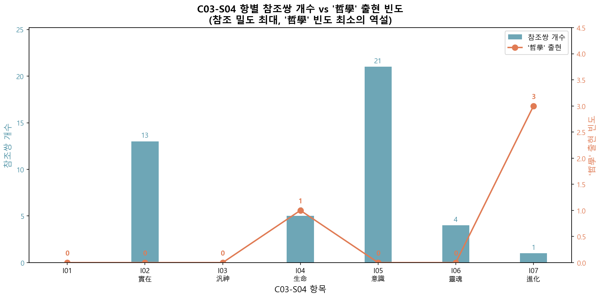

# 제국의 철학, 식민지의 전유

**이노우에 데츠지로 『철학과 종교』(1915)와 이돈화 『인내천요의』(1924)의 디지털 문헌학적 비교 분석**

2026-01-24

---

## Ⅰ. 머리말

### 1. 문제의 배경: 왜 이 현상에 주목하는가

식민지 조선에서 서양 근대 사상의 수용은 대부분 일본을 경유하였다. 번역어의 채택에서부터 개념의 해석에 이르기까지, 일본이라는 매개는 조선 지식인들의 사유를 조건 지었다. 그러나 이 '경유'는 단순한 중계가 아니었다. 일본에서 특정한 맥락과 목적 아래 재구성된 서양 사상이 조선에 유입되었고, 조선의 지식인들은 이를 다시 자신들의 맥락에서 전유하였다. 이 이중의 굴절 과정에서 원본의 의미가 어떻게 변형되었는가는 한국 근대 사상사의 핵심 질문 중 하나이다.

이노우에 데츠지로(井上哲次郎, 1856-1944)의 '현상즉실재론(現象卽實在論)'은 이러한 굴절의 전형적 사례를 제공한다. 이노우에는 도쿄제국대학 철학과 교수로서 서양 철학을 일본에 이식하는 데 핵심적 역할을 담당했으나, 그의 철학은 단순한 학술적 수입이 아니었다. 그는 현상즉실재론을 천황제 국가의 정신적 기초를 제공하는 **국체론적 철학**으로 정립하고자 하였다. 서양의 관념론과 실재론을 종합하여 '현상이 곧 실재'라는 명제를 도출하고, 이를 통해 천황을 정점으로 하는 일본의 국가 체제가 단순한 정치적 구성물이 아니라 우주적 실재의 현현임을 논증하려 한 것이다.

그런데 이 국체론적 철학이 식민지 조선의 민족종교인 천도교에 수용되었다면, 이는 무엇을 의미하는가? 천도교의 핵심 교리인 '인내천(人乃天, 사람이 곧 하늘)'을 철학적으로 정립하려 한 이돈화(李敦化, 1884-?)가 이노우에의 논리를 참조했다는 사실은 단순한 '지식의 이전'으로 환원될 수 없다. 이는 **제국의 이데올로기가 피식민지에서 어떻게 전유되고 변용되는가**를 실증할 수 있는 사례이기 때문이다.

### 2. 텍스트 선정: 왜 이 두 텍스트인가

본 연구는 이노우에 데츠지로의 『철학과 종교(哲學と宗敎)』(1915)와 이돈화의 『인내천요의(人乃天要義)』(1924)를 비교 분석한다.

『철학과 종교』는 이노우에가 서문에서 밝힌 바, **최근 4-5년간 발표한 철학과 종교 관련 논문을 모은 것**이다. 현상즉실재론, 생명론, 의식론 등 그의 철학적 논의와 불교·기독교·유교에 대한 비교종교학적 평가가 함께 수록되어 있다. 1915년 간행되었으므로, 이돈화가 『인내천요의』(1924)를 저술하기 이전에 접근 가능했던 텍스트이다.

『인내천요의』는 이돈화가 천도교의 '인내천' 사상을 **철학적으로 정립**하려 한 대표작이다. 천도교의 교리를 단순히 해설하는 데 그치지 않고, 서양 철학의 개념과 논증 방식을 동원하여 인내천 사상의 보편적 타당성을 논증하고자 하였다.

두 텍스트는 허수(2011)에 의해 영향 관계가 이미 확인되었다. 『철학과 종교』는 도쿄국회도서관에서 스캔본으로 서비스 중이며, 『인내천요의』는 출력·제본된 사료 상태였다. 본 연구를 위해 두 텍스트의 스캔본을 OCR로 텍스트화하고 검수 과정을 거쳐 분석 가능한 코퍼스로 구축하였다. 본 연구는 이 두 텍스트를 디지털 문헌학적 방법으로 재검토함으로써, 선행연구가 정성적으로 포착한 현상을 정량적으로 실증하고자 한다.

### 3. 선행연구의 의의

허수(2011)는 이돈화의 『인내천요의』가 이노우에 데츠지로의 『철학과 종교』를 참조했음을 **최초로 밝힌** 연구이다. 허수는 두 텍스트의 구조와 내용을 비교하여, 이돈화가 이노우에의 현상즉실재론을 수용하면서도 이를 인내천 사상의 철학적 기초로 재해석했음을 논증하였다.

이후 허수(2015)는 이 논의를 심화하여 **'소거(消去)'** 개념을 제시하였다. 허수에 따르면, 이돈화의 텍스트에서 이노우에의 이름이나 저서 전거가 명시적으로 밝혀지지 않았으며, 시간이 갈수록 그 내용에 대한 언급도 희미해지는 현상이 관찰된다. 이는 이돈화가 이노우에의 논리를 차용하면서도 그 출처를 의도적으로 감추었을 가능성을 시사한다.

### 4. 선행연구의 한계

그러나 허수(2015)는 다음 질문에 답하지 못했다:

첫째, **범위의 문제**이다. 이돈화의 차용은 '현상즉실재론' 부분에 국한되는가, 아니면 텍스트 전반에 걸친 것인가? 허수의 분석은 주로 현상즉실재론 관련 구절에 집중되어 있어, 차용의 전체적 범위와 분포를 파악하기 어렵다.

둘째, **실증의 문제**이다. '소거'는 정성적 관찰에 기반한 인상인가, 아니면 정량적으로 검증 가능한 현상인가? 허수는 이노우에의 이름이 언급되지 않는다는 점을 지적했으나, 이것이 체계적인 소거 전략인지 우연적 누락인지는 실증되지 않았다.

셋째, **메커니즘의 문제**이다. 이돈화가 이노우에의 논리는 가져오면서 '철학'이라는 이름을 소거했다면, 그 빈자리를 무엇으로 채웠는가? 소거의 존재를 확인하는 것과 소거의 방식을 해명하는 것은 다른 차원의 질문이다.

### 5. 연구질문

위의 한계를 극복하기 위해, 본 연구는 다음 두 가지 질문에 답하고자 한다:

> **[RQ1]** 이돈화의 『인내천요의』는 이노우에의 『철학과 종교』를 **어디서, 얼마나** 참조했는가?

> **[RQ2]** 참조 과정에서 **'哲學'이라는 기표**는 어떻게 처리되었는가?

RQ1은 차용의 범위와 분포를 정량적으로 확인하는 질문이다. 두 텍스트 간의 유사도를 문단 단위로 산출하고, 유의미한 참조 관계를 보이는 쌍들의 분포를 분석함으로써 답할 수 있다.

RQ2는 소거의 메커니즘을 해명하는 질문이다. '哲學'이라는 단어의 빈도 변화를 추적하고, 참조 관계에 있는 문단 쌍에서 '哲學'이 어떤 단어로 대체되었는지를 분석함으로써 답할 수 있다.

---

## Ⅱ. 연구 설계

### 1. 코퍼스 구축과 한자어 토큰화

#### 1.1 분석 대상 코퍼스

본 연구는 다음 두 텍스트를 디지털 코퍼스로 구축하여 분석하였다.

| 텍스트 | 원저자 | 간행년 | 행 수 | 문단 수 |
|--------|--------|--------|-------|---------|
| 『철학과 종교』 | 이노우에 데츠지로 | 1915 | 11,088 | 626 |
| 『인내천요의』 | 이돈화 | 1924 | 2,254 | 366 |

두 텍스트는 물리적 분량에서 약 3:1의 비대칭성을 보인다. 이러한 비대칭성은 절대빈도 비교를 어렵게 하므로, 본 연구에서는 상대빈도(천분율, ‰)를 함께 활용하였다.

#### 1.2 구조 체계

두 텍스트는 서로 다른 계층 구조를 가진다.

**『철학과 종교』(1915)**
- 28개 장(C00~C28), 장-문단-문장 체계
- `C##-P##-S##` 형식의 식별자
- 각 장은 독립적인 강연/논문에 해당

**『인내천요의』(1924)**
- 6개 장(C01~C06), 장-절-항-문단-문장 체계
- `C##-S##-I##-P##-S##` 형식의 식별자
- 보다 정교한 계층 구조

#### 1.3 한자어 토큰화

두 텍스트 모두 한자어가 핵심 개념어로 기능한다. 본 연구는 정규표현식 `[一-龥]{2,}`를 사용하여 **2자 이상의 한자어**를 토큰으로 추출하였다.

```
예시: "唯物論과 唯心論의 對立" → {唯物論, 唯心論, 對立}
```

이 방식은 조사, 어미 등 문법적 요소를 자동으로 제거하면서 핵심 개념어를 추출할 수 있다는 장점이 있다. 다만 순한글 표현이나 1자 한자어는 분석에서 제외된다는 한계가 있다.

#### 1.4 분석 단위

본 연구는 **문단(paragraph)**을 분석의 기본 단위로 설정하였다. 문장 단위로 비교하면 '宗敎', '世界' 같은 흔한 단어 하나만 겹쳐도 유사하다고 판정되어 무의미한 일치가 너무 많이 잡힌다. 반대로 장 단위로 비교하면 한 장 안에 여러 주제가 섞여 있어 구체적인 참조 지점을 특정하기 어렵다. 문단은 하나의 논점을 전개하는 의미 단위로서, 참조 관계를 포착하기에 적절한 크기이다.

| 텍스트 | 문단 수 | 문단당 평균 한자어 종류 |
|--------|---------|------------------------|
| 1915 철학과 종교 | 626개 | **40.2종** |
| 1924 인내천요의 | 366개 | **31.7종** |

*주: 자카드 유사도는 집합 연산이므로, 중복을 제거한 고유 단어 종류(types)를 기준으로 산출한다.*

### 2. 자카드 유사도와 임계값 0.1

#### 2.1 자카드 유사도

두 문단 간의 유사도는 **한자어 자카드 유사도(Jaccard similarity)**로 측정하였다.

```
J(A, B) = |A ∩ B| / |A ∪ B|
```

- A, B: 각 문단에 포함된 한자어 집합
- |A ∩ B|: 공통 한자어 종류 수
- |A ∪ B|: 전체 한자어 종류 수 (합집합)

자카드 유사도는 0(완전 불일치)에서 1(완전 일치)까지의 값을 가지며, 두 집합이 얼마나 겹치는지를 직관적으로 나타낸다.

#### 2.2 전수 비교

1915 텍스트의 626개 문단과 1924 텍스트의 366개 문단을 전수 비교하여, 총 **228,490개 문단 쌍**의 유사도를 산출하였다.

```
626 × 366 - (빈 문단 제외) = 228,490 쌍
```

#### 2.3 임계값 0.1의 타당성

**통계적 근거**

228,490개 쌍의 유사도 분포는 다음과 같다:

| 통계량 | 값 |
|--------|-----|
| 평균 (μ) | 0.005 |
| 표준편차 (σ) | 0.013 |
| 중앙값 | 0.000 |
| P99 | 0.048 |
| P99.94 (135개) | 0.100 |

228,490개 쌍의 평균 유사도는 0.005에 불과하다. 임계값 0.1은 이 평균의 **20배**에 달하는 값이다. 실제로 22만 8천여 개 쌍 중 유사도 0.1을 넘는 경우는 **135개(0.06%)**에 불과했다. 이처럼 극소수만이 도달하는 높은 유사도는 우연의 일치로 보기 어려우며, 실질적인 참조 관계가 있는 쌍으로 간주할 수 있다.

**의미론적 근거: 문단 단위에서 0.1의 의미**

자카드 공식을 정리하면, 유사도 0.1을 달성하기 위해 필요한 공통 토큰 수는 다음과 같다:

```
|A ∩ B| = (|A| + |B|) / 11
```

| 문단A 종류 | 문단B 종류 | 필요 공통 종류 |
|-----------|-----------|---------------|
| 10종 | 10종 | 최소 2종 |
| 20종 | 20종 | 최소 4종 |
| **40종** | **32종** | **최소 7종** |

평균적인 문단 크기(1915: 40종, 1924: 32종)에서 유사도 0.1을 달성하려면, **최소 7종의 동일한 한자어**가 두 문단에 공통으로 등장해야 한다. '宗敎', '世界' 같은 범용어 1~2개만 공유해서는 0.1에 도달할 수 없다. '唯物論', '唯心論', '實在論' 같은 **특정 주제의 전문 개념어**가 여러 개 겹쳐야 비로소 0.1에 도달한다.

**실제 사례: 유사도 0.10 근처 참조쌍**

```
[Rank 111] 유사도 = 0.1042
  1915 문단: 8종 한자어
  1924 문단: 10종 한자어
  공통: 2종 {佛敎, 基督敎}

[Rank 113] 유사도 = 0.1026
  1915 문단: 9종 한자어
  1924 문단: 9종 한자어
  공통: 2종 {一神敎, 超人的}
```

유사도 0.1 근처에서도 '一神敎', '超人的' 같은 **종교학 핵심 개념어**가 공유되어야 도달 가능하다.

---

## Ⅲ. 참조쌍 분석

### 1. 노이즈 필터링과 111개 유효 쌍

#### 1.1 초기 후보: 135개 쌍

임계값 0.1 이상인 135개 쌍을 초기 후보로 선정하였다.

| 유사도 구간 | 쌍 수 |
|-------------|-------|
| 0.10~0.149 | 76개 |
| 0.15~0.199 | 32개 |
| 0.20 이상 | 27개 |
| **합계** | **135개** |

#### 1.2 노이즈의 정의와 유형

유사도 0.1 이상이더라도, 공유 토큰이 **내용적으로 무의미한 경우** 노이즈로 분류하였다.

**유형 1: 서수만 공유 (7개)**

두 문단이 '第一', '第二', '第三' 등 번호 표기만 공유하고, 내용상 핵심 개념어는 공유하지 않는 경우.

```
예시 [Rank 69]:
  1915: "第一に..." (第一만 포함)
  1924: "第一 儒敎와..." (第一만 포함)
  공통 토큰: {第一} → 서수만 공유, 노이즈
```

**유형 2: 범용어만 공유 (17개)**

'宇宙', '世界', '如何', '對照', '區別' 등 특정 학술 맥락을 지시하지 않는 범용어만 공유하는 경우.

```
예시 [Rank 72]:
  공통 토큰: {如何, 宇宙}
  → 범용어만 공유, 학술적 참조 관계 없음
```

#### 1.3 유효 쌍 확정: 111개

| 구분 | 개수 |
|------|------|
| 초기 후보 | 135개 |
| 노이즈 (서수) | -7개 |
| 노이즈 (범용어) | -17개 |
| **유효 쌍** | **111개** |

노이즈 제외 후 **111개 쌍**이 실질적 참조 관계를 보이는 유효 쌍으로 확정되었다.

### 2. 장-절 분포와 핵심 구간

#### 2.1 1924 텍스트 장별 분포

111개 유효 쌍이 1924 텍스트의 어느 장에 분포하는지 분석하였다.

| 1924 장 | 제목 | 유효 쌍 | 비율 |
|---------|------|---------|------|
| C01 | 緖言 | 3개 | 3% |
| C02 | 人乃天과 天道 | 0개 | 0% |
| C03 | 人乃天과 眞理 | 45개 | 41% |
| C04 | 人乃天의 目的 | 0개 | 0% |
| C05 | 人乃天의 修煉 | 0개 | 0% |
| C06 | 人乃天에 對한 雜感 | 63개 | 57% |
| **합계** | | **111개** | **100%** |

참조쌍은 **C03(人乃天과 眞理)**과 **C06(人乃天에 對한 雜感)**에 집중되어 있으며, 두 장이 전체의 **97%**를 차지한다.

#### 2.2 장-장 히트맵


*그림 1. 장-장 단위 유효 참조쌍 분포 (111개, 자카드 유사도 ≥ 0.1). 색상은 참조쌍 개수, 괄호 안은 평균 유사도.*

히트맵에서 확인되는 주요 참조 관계:

| 1915 장 | 1924 장 | 쌍 수 | 내용 |
|---------|---------|-------|------|
| C02 (현상즉실재론) | C03 (人乃天과 眞理) | 13개 | 唯物/唯心→實在 논증 |
| C06 (의식론) | C03 (人乃天과 眞理) | 24개 | 헤켈 6종 의식론 |
| C13 (기독교와 유교) | C06 (人乃天에 對한 雜感) | 31개 | 儒基 비교 프레임 |
| C14 (불교와 기독교) | C06 (人乃天에 對한 雜感) | 20개 | 佛基 비교 프레임 |

#### 2.3 핵심 구간: C03-S04 (人乃天과 眞理 제4절)

C03 내에서도 **제4절(S04)**에 참조쌍이 집중되어 있다. 이 절은 7개 항(I01~I07)으로 구성되어 있으며, 각 항은 '實在와 人乃天', '意識과 人乃天', '進化와 人乃天' 등 철학적 주제와 인내천 사상을 연결하는 논의를 담고 있다.

| 항 | 제목 | 참조쌍 | 참조 원천 (1915) |
|----|------|--------|-----------------|
| I01 | 實現思想과 人乃天 | 0개 | - |
| **I02** | **實在와 人乃天** | **13개** | C02 (현상즉실재론) |
| I03 | 汎神觀과 人乃天 | 0개 | - |
| I04 | 生命과 人乃天 | 5개 | C05 (생명론) |
| **I05** | **意識과 人乃天** | **21개** | C06 (의식론) |
| I06 | 靈魂과 人乃天 | 4개 | C05 (생명론) |
| I07 | 進化와 人乃天 | 1개 | C08 (진화론) |

I02(實在)와 I05(意識)에 참조쌍이 집중되어 있다. 이는 이돈화가 이노우에의 **현상즉실재론**과 **의식론**을 집약적으로 차용했음을 보여준다.

#### 2.4 핵심 구간: C06-S06 (人乃天에 對한 雜感 제6절)

C06 내에서는 **제6절(S06)**에 참조쌍이 집중되어 있다. 이 절은 유교·불교·기독교를 비교하는 내용을 담고 있으며, 이노우에의 C13(기독교와 유교)과 C14(불교와 기독교)를 참조한다.

| 1915 장 | 1924 절 | 쌍 수 | 비교 항목 |
|---------|---------|-------|----------|
| C13 (기독교와 유교) | C06-S06 | 31개 | 信仰/德敎, 創造/發展, 復活, 兼愛/差別愛 |
| C14 (불교와 기독교) | C06-S06 | 20개 | 沒我敎/主我敎, 涅槃/天國, 汎神/一神 |

이돈화는 이노우에의 **비교종교학적 프레임워크**를 그대로 차용하여, 천도교와 기존 종교들을 비교하는 논의에 활용하였다.

---

## Ⅳ. 차용의 양상과 해석

### 1. '이데올로기적 모듈'로서의 선별적 수용

#### 1.1 차용의 선별성

111개 유효 참조쌍의 분포는 이돈화의 차용이 **무차별적 수용이 아니라 고도로 선별적인 수용**이었음을 보여준다.

| 차용된 내용 | 차용되지 않은 내용 |
|-------------|-------------------|
| 현상즉실재론 (C02) | 일본 국체론 (C24-28) |
| 헤켈 의식론 (C06) | 일본 신도론 (C25) |
| 생명론 (C05) | 일본 불교 우월론 |
| 儒基/佛基 비교 프레임 (C13-14) | 일본 중심주의 |

이노우에 텍스트의 후반부에 배치된 일본 국체론, 신도론, 일본 불교 우월론 등은 단 한 건의 참조쌍도 발견되지 않는다. 이돈화는 이노우에의 **철학적·논리적 도구**만을 선별적으로 가져오고, **일본 중심적 이데올로기**는 철저히 배제한 것이다.

#### 1.2 '이데올로기적 모듈'로서의 활용

이돈화가 차용한 내용들은 특정한 공통점을 가진다:

1. **보편성을 주장할 수 있는 논리**: 唯物/唯心→實在의 변증법, 의식의 6단계 이론 등
2. **비교종교학적 프레임**: 沒我敎/主我敎, 汎神敎/一神敎 등의 분류 체계
3. **과학적 권위를 동반하는 논의**: 헤켈, 메치니코프 등 서양 학자 인용

이러한 요소들은 특정 종교나 국가에 종속되지 않는 **'이데올로기적 모듈'**로서 기능할 수 있다. 이돈화는 이 모듈들을 이노우에의 맥락에서 분리하여, 천도교 인내천 사상을 정당화하는 데 재활용한 것이다.

#### 1.3 가치의 전복

특히 주목할 점은 이노우에의 비교종교학적 프레임이 **가치 평가의 전복**을 동반한다는 것이다.

| 비교 항목 | 이노우에의 평가 | 이돈화의 활용 |
|----------|----------------|---------------|
| 沒我敎/主我敎 | 불교의 특성으로 제시 | 인내천은 이 구분을 초월 |
| 汎神敎/一神敎 | 종교 유형 분류 | 인내천은 양자를 종합 |
| 唯物/唯心 | 실재론으로 지양 | 인내천으로 지양 |

이노우에에게 이 프레임들은 일본 불교의 우월성을 논증하기 위한 도구였다. 그러나 이돈화는 동일한 프레임을 사용하면서 결론을 **인내천의 우월성**으로 전환한다. 논리의 뼈대는 유지하되, 그 논리가 향하는 방향을 180도 전환한 것이다.

### 2. '哲學' 기표의 소거와 대체어 전략

#### 2.1 '哲學' 빈도의 급락

두 텍스트에서 '哲學'이 차지하는 위상을 비교하였다.

| 텍스트 | '哲學' 순위 | 빈도 | 상대빈도(‰) |
|--------|------------|------|-------------|
| 1915 철학과 종교 | **8위** | 365회 | 9.14‰ |
| 1924 인내천요의 | **518위** | 6회 | 0.38‰ |

'哲學'은 이노우에의 텍스트에서 상위 10위권 핵심어로 기능하지만, 이돈화의 텍스트에서는 518위로 추락한다. 이는 **510계단의 하락**, 상대빈도 기준 **95.9%의 감소**에 해당한다.

**주요 개념어 순위 변동 비교**

| 단어 | 1915 순위 | 1924 순위 | 변동 |
|------|----------|----------|------|
| **哲學** | 8위 | 518위 | **-510** |
| 宗敎 | 1위 | 11위 | -10 |
| 生命 | 3위 | 2위 | +1 |
| 進化 | 116위 | 8위 | +108 |
| 眞理 | 260위 | 31위 | +229 |

'生命', '宗敎' 등 다른 핵심 개념어들은 순위가 유지되거나 소폭 변동하는 데 비해, '哲學'만이 유독 급격한 하락을 보인다.

#### 2.2 참조 밀도와 '哲學' 빈도의 역상관

C03-S04 구간을 항별로 분석한 결과, **참조 밀도가 높은 곳에서 '哲學' 빈도가 최소**라는 역설적 현상이 확인되었다.

| 항 | 제목 | 참조쌍 | '哲學' 출현 |
|----|------|--------|------------|
| I02 | 實在와 人乃天 | **13개** | **0회** |
| I05 | 意識과 人乃天 | **21개** | **0회** |
| I07 | 進化와 人乃天 | 1개 | 3회 |



*그림 2. C03-S04 항별 참조쌍 개수(막대)와 '哲學' 출현 빈도(선). 참조 밀도가 높은 I02, I05에서 '哲學'은 0회.*

I05(意識과 人乃天)는 참조쌍 **21개로 최다**이지만 '哲學'은 **0회**이다. 반면 I07(進化와 人乃天)은 '哲學'이 **3회**이지만 참조쌍은 **1개뿐**이다. 이는 **철학적 논의가 집중된 곳에서 '哲學'은 완전히 부재하고, '哲學'이 등장하는 곳에서는 참조가 거의 없다**는 명확한 역상관관계를 보여준다.

#### 2.3 대체어 패턴 분석

111개 유효 참조쌍 중 1915 문단에 '哲學'이 포함된 쌍을 추출하여 1924 대응 문단과 비교하였다.

| 구분 | 개수 |
|------|------|
| 1915에 '哲學' 포함 참조쌍 | 5개 |
| 그 중 1924에도 '哲學' 있음 | 1개 |
| **1924에서 '哲學' 소거됨** | **4개** |

4개 소거 사례에서 세 가지 대체 패턴이 확인되었다:

**패턴 A: '哲學的價値/系統' → '哲人' + '眞理'**

```
[1915] C02-P01: "唯物論と唯心論とに對する實在論の哲學的價値といふこと..."
[1915] C02-P22: "唯心論と申しまする中には色々な哲學系統が含まれて..."

[1924] C03-S04-I02-P01: "네로부터 哲人들이 宇宙를 觀하는 眞理에 잇서
                        두 가지 큰 潮流가 잇나니 하나는 唯物論이오
                        하나는 唯心論이라"
```

이노우에의 '哲學的 價値', '哲學系統'(추상적 학문 체계)이 이돈화의 '哲人들이... 眞理에 있어서'(구체적 행위자 + 목표)로 대체되었다.

**패턴 B: '哲學宗敎의 特色' → '理想의 境涯'**

```
[1915] C14-S04-P05: "涅槃は究竟目的でありまして實に印度の哲學宗敎の特色であります"

[1924] C06-S06-P16: "佛敎는 最後 理想의 境涯를 涅槃이라 하엿스나..."
```

이노우에의 '哲學宗敎의 特色'(학문적 범주)이 이돈화의 '理想의 境涯'(도달해야 할 경지)로 대체되었다.

**패턴 C: '哲學宗敎의 特色' → '沒我敎/主我敎'**

```
[1915] C14-S04-P05: "印度の哲學宗敎の特色" (동일)

[1924] C06-S06-P14: "佛敎는 沒我敎이나 基督敎는 主我敎이라..."
```

이노우에의 '哲學宗敎'(학문적 분류)가 이돈화의 '沒我敎/主我敎'(종교 유형의 직접적 명칭)로 대체되었다.

#### 2.4 대조군: '哲學' 유지 사례

'哲學'이 소거되지 않고 유지된 유일한 참조쌍을 대조군으로 분석하였다.

```
[1915] C14-S02-P05: "佛敎は亦哲學であります。哲學と宗敎と此の兩つのものが..."

[1924] C06-S06-P11: "佛敎의 敎理는 元來 組織的 演繹的
                    (例如 四聖諦 八正道 其他 認識論的 哲學) 으로..."
```

이 사례에서 '哲學'이 유지된 이유는 명확하다: 이노우에가 "불교는 또한 **철학**이다"라고 불교 내부의 철학적 성격을 지적한 것을 이돈화도 그대로 수용한 것이다. 여기서 '哲學'은 서양 근대 학문의 권위가 아니라 **불교 교리 자체의 특성**을 지칭한다. 이돈화가 소거한 것은 '서양 철학의 제도적 권위'이지, '철학적 사유 일반'이 아님을 보여주는 대조군이다.

#### 2.5 종합: '기표의 소거, 기의의 전유'

| 패턴 | 1915 원어 | 1924 대체어 | 전략 |
|------|----------|------------|------|
| **A** | 哲學的價値, 哲學系統 | 哲人 + 眞理 | 학문 체계 → 행위자 + 목표 |
| **B** | 哲學宗敎의 特色 | 理想의 境涯 | 학문적 범주 → 도달해야 할 경지 |
| **C** | 哲學宗敎의 特色 | 沒我敎/主我敎 | 학문적 분류 → 종교 내적 명명 |

세 패턴 모두 **'哲學'이라는 학문적·제도적 프레임을 탈각**시키고, 대신 (A) 구체적 행위자와 보편적 목표, (B) 추구해야 할 이상적 경지, (C) 종교 자체의 언어로 대체한다는 공통점을 보인다.

이노우에에게 '철학'은 종교의 타당성을 검증하는 최종 심판관이었다. 그러나 이돈화에게 '인내천'은 서양 철학의 승인을 필요로 하는 대상이 아니라 그 자체로 자명한 진리였다. '哲學'이라는 기표의 소거는 곧 **검증의 주체를 교체**하려는 시도로 읽힌다.

---

## Ⅴ. 맺음말

### 1. 요약

본 연구는 이노우에 데츠지로의 『철학과 종교』(1915)와 이돈화의 『인내천요의』(1924)를 디지털 문헌학적 방법으로 비교 분석하여, 다음 두 연구질문에 답하였다.

**[RQ1] 어디서, 얼마나 참조했는가?**

228,490개 문단 쌍을 전수 비교하여 111개 유효 참조쌍을 확정하였다. 참조쌍은 C03(人乃天과 眞理)과 C06(人乃天에 對한 雜感)에 집중되어 있으며(97%), 특히 C03-S04의 I02(實在)와 I05(意識), C06-S06의 儒基/佛基 비교 구간에 밀집되어 있다. 이돈화는 이노우에의 현상즉실재론, 의식론, 비교종교학적 프레임을 집약적으로 차용하였으나, 일본 국체론·신도론 등 일본 중심적 이데올로기는 철저히 배제하였다.

**[RQ2] '哲學'이라는 기표는 어떻게 처리되었는가?**

'哲學'은 1915 텍스트에서 8위(365회)였으나, 1924 텍스트에서는 518위(6회)로 급락하였다. 특히 참조 밀도가 가장 높은 C03-S04 구간에서 '哲學'은 거의 등장하지 않는다는 역설이 확인되었다. 참조쌍 내 직접 비교 결과, '哲學的價値/系統'은 '哲人+眞理'로, '哲學宗敎'는 '理想의 境涯' 또는 '沒我敎/主我敎'로 대체되었다. 이돈화는 철학의 **논리는 가져오되, '철학'이라는 이름표는 떼어냄**으로써 서양 근대 학문의 제도적 권위에 종속되지 않는 독자적 논의 공간을 확보하였다.

### 2. 의의

본 연구의 의의는 다음과 같다:

첫째, 허수(2015)가 정성적으로 포착한 '소거' 현상을 **정량적으로 실증**하였다. '哲學' 빈도의 급락, 참조 밀도와 '哲學' 빈도의 역상관, 대체어 패턴의 확인은 '소거'가 우연적 누락이 아니라 **체계적 전략**이었음을 보여준다.

둘째, 제국의 철학이 피식민지에서 전유되는 **구체적 메커니즘**을 해명하였다. 이돈화는 이노우에의 논리를 '이데올로기적 모듈'로 분리하여 재활용하면서, 그 논리의 출처를 지칭하는 기표는 소거하였다. 이는 외래 권위에 기대지 않으면서도 근대적 논증력을 확보하는 이중 전략이다.

셋째, **디지털 문헌학**의 방법론적 가능성을 제시하였다. 대규모 텍스트의 전수 비교, 빈도 분석, 분포 시각화 등은 전통적 정성 분석으로는 불가능한 발견을 가능하게 한다.

### 3. 한계

본 연구의 한계는 다음과 같다:

첫째, **한자어 중심 분석의 한계**이다. 순한글 표현이나 문법적 요소는 분석에서 제외되었다. '人乃天'의 한글 표기 '인내천' 등은 별도의 처리가 필요하다.

둘째, **임계값의 한계**이다. 유사도 0.1 미만에서도 실질적 참조가 있을 수 있으나, 노이즈와의 구분이 어려워 분석에서 제외하였다. 정성적 보완이 필요하다.

셋째, **텍스트 외적 맥락의 한계**이다. 이돈화가 이노우에의 텍스트를 어떤 경로로 접했는지, 의도적 소거인지 무의식적 변형인지는 텍스트 분석만으로는 확정할 수 없다.

---

## 부록

### A. 분석 데이터 파일

| 파일 | 내용 |
|------|------|
| `data/analysis/validated_pairs_final.csv` | 111개 유효 참조쌍 |
| `data/analysis/word_rank_1915.csv` | 1915 텍스트 한자어 순위 |
| `data/analysis/word_rank_1924.csv` | 1924 텍스트 한자어 순위 |
| `data/analysis/c03s04_item_analysis.csv` | C03-S04 항별 분석 |
| `data/analysis/philosophy_substitution_patterns.csv` | 대체어 패턴 |

### B. 상위 20개 참조쌍

| 순위 | 유사도 | 1915 문단 | 1924 문단 | 공통 토큰 |
|------|--------|-----------|-----------|-----------|
| 1 | 0.3077 | C13-S01-P05 | C06-S06-P06 | 復活, 基督, 基督敎, 儒敎 |
| 2 | 0.2500 | C02-P29 | C03-S04-I02-P01 | 唯物論, 唯心論, 實在論 |
| 3 | 0.2500 | C06-P17 | C03-S04-I05-P03 | 意識, 本位, 細胞 |
| 4 | 0.2500 | C13-S03-P02 | C06-S06-P02 | 基督敎, 儒敎, 差異點 |
| 5 | 0.2500 | C14-S03-P01 | C06-S06-P09 | 佛敎, 基督敎, 宗敎 |
| ... | ... | ... | ... | ... |

### C. 참고문헌

- 허수 (2011). 『이돈화 연구』, 역사비평사.
- 허수 (2015). 「이돈화의 '인내천' 해석과 이노우에 데츠지로의 '현상즉실재론'」
- 井上哲次郎 (1915). 『哲學と宗敎』
- 李敦化 (1924). 『人乃天要義』

---

*본 보고서는 디지털 문헌학적 분석 결과를 종합한 것으로, 2026년 1월 24일 기준 데이터에 기반한다.*
