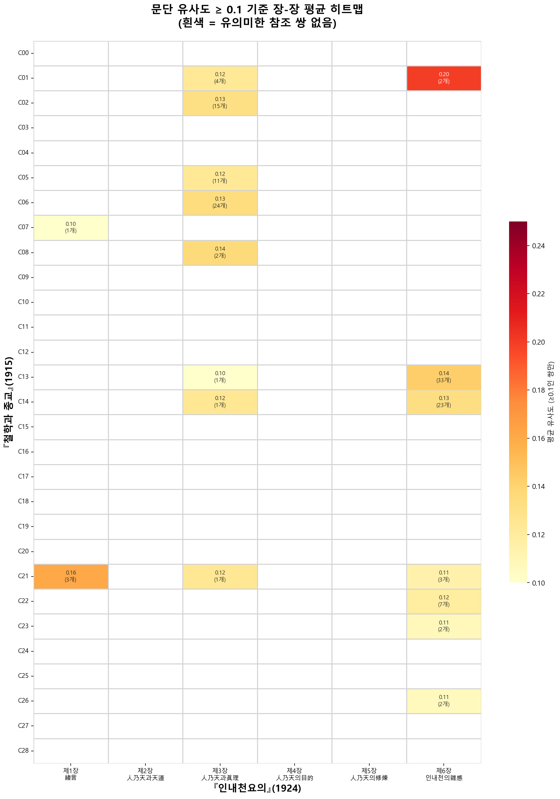

# 문단 단위 텍스트 유사도 분석 보고서

**『철학과 종교』(1915)와 『인내천요의』(1924) 간 지식 전이의 계량적 실증**

2026-01-24

---

## 요약 (Executive Summary)

본 보고서는 이노우에 데츠지로(井上哲次郎)의 『철학과 종교』(1915)와 이돈화의 『인내천요의』(1924) 간의 텍스트 관계를 **문단 단위 유사도 분석**을 통해 실증한다. 228,490개 문단 쌍을 전수 비교한 결과, 통계적으로 유의미한 **111개 고유사도 쌍**(상위 0.05%)을 확정하였다. 이 쌍들은 특정 주제 영역에 집중적으로 분포하며, 이돈화의 **선별적 차용 전략**—'보편적 지식'은 수용하되 '지역적 맥락'은 필터링—을 데이터로 뒷받침한다.

### 핵심 발견

| 분석 구간 | 유효 참조쌍 | 핵심 내용 |
|-----------|-------------|-----------|
| **C06 × C03-S04** | 23개 | 생명의 정의, 의식론 분류 |
| **C07 × C03-S04** | **0개** | 일본 학계 내부 논쟁 (필터링) |
| **C13 × C06-S06** | 31개 | 기독교와 유교 비교 프레임워크 |
| **C14 × C06-S06** | 20개 | 불교와 기독교 비교 프레임워크 |

---

## 제1장 연구 배경과 목적

### 1.1 연구 대상 텍스트

| 텍스트 | 저자 | 출간 | 분량 |
|--------|------|------|------|
| 『철학과 종교』 | 이노우에 데츠지로 | 1915년 | 약 560쪽, 28개 장 |
| 『인내천요의』 | 이돈화 | 1924년 | 약 200쪽, 6개 장 |

『철학과 종교』는 도쿄제국대학 철학과 교수 이노우에 데츠지로가 1914년 가을 경성에서 행한 연속 강연을 정리한 것으로, 진화론적 생명관, 현상즉실재론, 비교종교론 등을 포괄한다. 『인내천요의』는 천도교 이론가 이돈화가 천도교의 핵심 교리 '인내천(人乃天)'을 철학적으로 정립한 교리서이다.

### 1.2 연구 문제

선행 연구에서 이돈화가 이노우에의 현상즉실재론을 참조했다는 정성적 지적이 있었으나, **구체적으로 어떤 내용이, 어느 정도로, 어떤 맥락에서** 차용되었는지는 규명되지 않았다. 본 연구는 다음 질문에 답한다:

1. 두 텍스트 간 유의미한 유사성을 보이는 문단 쌍은 몇 개인가?
2. 그 쌍들은 어떤 주제 영역에 집중되어 있는가?
3. 이돈화는 이노우에의 어떤 내용을 선별적으로 수용/배제했는가?

---

## 제2장 연구 방법론

### 2.1 코퍼스 구축

양 텍스트를 **문장 단위**로 디지털화한 후, 동일 문단에 속하는 문장들을 집계하여 **문단 단위 코퍼스**를 구축하였다.

| 텍스트 | 문단 수 | 평균 문장 수/문단 |
|--------|---------|-------------------|
| 1915 | 626개 | 4.2문장 |
| 1924 | 365개 | 3.8문장 |

**분석 제외 조건**:
- `line_class`가 `RTC_TEXT`, `ANNOTATION`인 행 제외
- `structure_id`가 `TOC`, `ROOT`인 행 제외
- `line_class`가 `STRUCT`인 행은 구조 정보로만 활용

### 2.2 유사도 측정: 한자어 자카드 유사도

1910-20년대 한국어 텍스트는 학술 개념이 주로 **한자어**로 표현되었다. 이 특성을 반영하여 **한자어 자카드 유사도(Hanja Jaccard Similarity)**를 설계하였다.

#### 2.2.1 토큰화

정규표현식 `[一-龥]{2,}`를 사용하여 각 문단에서 **2자 이상의 한자어**를 추출한다.

```
예시 문단: "네로부터 哲人들이 宇宙를 觀하는 眞理에 잇서 두 가지 큰潮流가 잇나니..."
추출 토큰: {哲人, 宇宙, 眞理, 潮流}
```

#### 2.2.2 유사도 계산

두 문단 A, B의 토큰 집합에 대해 자카드 계수를 계산한다:

```
Jaccard(A, B) = |A ∩ B| / |A ∪ B|
```

- 범위: 0.0 (공통 토큰 없음) ~ 1.0 (완전 일치)
- 해석: 0.1은 대략 "전체 어휘 중 10%가 공유됨"을 의미

#### 2.2.3 방법론적 장점

| 장점 | 설명 |
|------|------|
| **개념 중심** | 조사·어미 등 문법 요소의 차이에 영향받지 않음 |
| **언어 혼합 대응** | 한글-한자 혼용 텍스트에서도 핵심 개념 추출 가능 |
| **해석 용이** | 공통 토큰을 직접 확인하여 유사성의 실체 파악 가능 |

### 2.3 전수 비교

626개 × 365개 = **228,490개 문단 쌍**을 전수 비교하였다. 이는 모든 가능한 조합을 검토하여 **누락 없이** 참조 관계를 탐지하기 위함이다.

---

## 제3장 유사도 분포와 임계값 설정

### 3.1 전체 유사도 분포

```
총 문단 쌍:     228,490개
평균 (μ):       0.0050
표준편차 (σ):   0.0133
중앙값:         0.0000
최대값:         0.3077
```

대부분의 쌍(약 80%)이 유사도 0을 보이며, 평균도 0.005로 매우 낮다. 이는 두 텍스트가 전반적으로 상이한 내용을 다루고 있음을 반영한다.

### 3.2 백분위 분포

| 백분위 | 유사도 |
|--------|--------|
| P90 | 0.0185 |
| P95 | 0.0256 |
| P99 | 0.0429 |
| P99.5 | 0.0517 |
| P99.94 (135개) | 0.1000 |

유사도 0.1 이상은 상위 **0.06%**(135개)에 해당하며, 이는 통계적으로 극히 예외적인 값이다.

### 3.3 임계값 0.1의 타당성

#### 3.3.1 분포론적 근거

유사도 분포는 0.05 부근에서 급격한 밀도 감소를 보이며, 0.1 이상에서는 거의 평탄한 꼬리 분포를 형성한다. 이 **급감 지점(elbow)**이 '우연적 유사성'과 '실질적 참조 관계'를 구분하는 자연스러운 경계이다.

#### 3.3.2 의미론적 근거

유사도 0.1을 달성하려면 두 문단이 **최소 1개 이상의 핵심 개념어**를 공유해야 한다. 예를 들어:
- 한 문단에 10개의 한자어가 있고
- 다른 문단에 10개의 한자어가 있을 때
- 2개 이상의 공통 토큰이 있어야 0.1 이상 가능

단순히 '基督敎', '佛敎' 같은 일반 용어 하나만 공유해서는 도달하기 어려운 수준이다.

#### 3.3.3 비교 기준

| 임계값 | 쌍 수 | 비율 | 평가 |
|--------|-------|------|------|
| 0.05 | 약 1,200개 | 0.5% | 너무 느슨함 - 범용어 공유 다수 포함 |
| **0.10** | **135개** | **0.06%** | **적절** - 핵심 개념어 공유 |
| 0.15 | 약 35개 | 0.015% | 너무 엄격함 - 실질적 참조 누락 |

---

## 제4장 노이즈 필터링

### 4.1 노이즈의 정의

유사도 0.1 이상이더라도, 공유 토큰이 **내용적으로 무의미한 경우** 노이즈로 분류하였다.

### 4.2 노이즈 유형

#### 유형 1: 서수만 공유 (7개)

두 문단이 '第一', '第二', '第三' 등 **번호 표기만** 공유하는 경우.

```
예시:
- 1915: "第一に基督敎は宗敎として發達して..."
- 1924: "第一 儒敎와 基督敎의 差異点으로..."
- 공통 토큰: {第一}
- 판정: 노이즈 (번호만 일치, 내용 무관)
```

#### 유형 2: 범용어만 공유 (17개)

'如何', '對照', '區別', '差異點', '宇宙'(단독), '世界'(단독) 등 **일반적 표현만** 공유하는 경우.

```
예시:
- 1915: "如何に佛敎と基督敎を調和しやうとしても..."
- 1924: "第二 . 佛敎와 基督敎의 差異点을 들러 보면"
- 공통 토큰: {如何, 對照} 또는 {差異點} 단독
- 판정: 노이즈 (메타적 표현만 일치)
```

### 4.3 필터링 결과

| 범주 | 개수 | 비율 |
|------|------|------|
| 유효 참조쌍 | **111개** | 82.2% |
| 서수 노이즈 | 7개 | 5.2% |
| 범용어 노이즈 | 17개 | 12.6% |
| **합계** | **135개** | 100% |

### 4.4 유효 참조쌍의 특성

111개 유효 참조쌍은 다음과 같은 **학술 개념어**를 공유한다:

| 개념 영역 | 대표 토큰 |
|-----------|-----------|
| 철학 | 唯物論, 唯心論, 實在, 精神, 物質 |
| 생명/의식 | 生命, 意識, 細胞, 原子, 神經 |
| 종교 | 基督敎, 佛敎, 儒敎, 信仰, 宗敎 |
| 비교종교 | 神人敎, 神政敎, 沒我敎, 主我敎 |
| 윤리 | 道德, 兼愛, 差別愛, 性善, 性惡 |

---

## 제5장 장-장 단위 분포 분석

### 5.1 히트맵 개요

111개 유효 참조쌍을 1915년 텍스트의 장(C00-C28)과 1924년 텍스트의 장(C01-C06)으로 집계한 히트맵을 생성하였다.



*그림 1. 장-장 단위 유효 참조쌍 분포 (111개). 색상은 참조쌍 개수를 나타내며, 괄호 안은 평균 유사도. C03(人乃天과眞理)과 C06(인내천의雜感)에 참조가 집중됨.*

### 5.2 참조쌍 분포표

| 1915 장 | C01 | C02 | C03 | C04 | C05 | C06 | 합계 |
|---------|-----|-----|-----|-----|-----|-----|------|
| C01 | 0 | 0 | 4 | 0 | 0 | 2 | 6 |
| C02 | 0 | 0 | **15** | 0 | 0 | 0 | 15 |
| C05 | 0 | 0 | **11** | 0 | 0 | 0 | 11 |
| C06 | 0 | 0 | **24** | 0 | 0 | 0 | 24 |
| C07 | 1 | 0 | 0 | 0 | 0 | 0 | 1 |
| C08 | 0 | 0 | 2 | 0 | 0 | 0 | 2 |
| C13 | 0 | 0 | 1 | 0 | 0 | **31** | 32 |
| C14 | 0 | 0 | 1 | 0 | 0 | **20** | 21 |
| C21 | 3 | 0 | 1 | 0 | 0 | 3 | 7 |
| C22 | 0 | 0 | 0 | 0 | 0 | 7 | 7 |
| 기타 | 0 | 0 | 0 | 0 | 0 | 6 | 6 |
| **합계** | 4 | 0 | **59** | 0 | 0 | **69** | **111** |

### 5.3 핵심 관찰

#### (1) C03 (人乃天과 眞理)에 59개(53%) 집중

『인내천요의』 제3장은 '진리'를 주제로 하며, 이노우에의 **철학론·생명론**을 가장 많이 참조한다.

| 1915 원천 | 참조쌍 | 내용 |
|-----------|--------|------|
| C06 (생명의 특징) | 24개 | 생명의 5종 특징, 의식론 |
| C02 (현상즉실재론) | 15개 | 唯物/唯心 → 實在 변증법 |
| C05 (생명의 정의) | 11개 | 생명-우주 존재론 |

#### (2) C06 (인내천의 잡감)에 69개(62%) 집중

『인내천요의』 제6장은 '세계 3대 종교 비교'를 주제로 하며, 이노우에의 **비교종교론**을 가장 많이 참조한다.

| 1915 원천 | 참조쌍 | 내용 |
|-----------|--------|------|
| C13 (기독교와 유교) | 31개 | 儒基 비교 프레임워크 |
| C14 (기독교와 불교) | 20개 | 佛基 비교 프레임워크 |
| C22 (불교와 기독교) | 7개 | 양 종교의 관계 |

#### (3) C02, C04, C05에는 참조쌍 없음

『인내천요의』 제2장(人乃天과 天道), 제4장(人乃天의 目的), 제5장(人乃天의 修煉)은 이노우에 텍스트와 유의미한 참조 관계가 발견되지 않았다. 이는 해당 장들이 **천도교 고유의 교리**를 다루고 있기 때문으로 해석된다.

---

## 제6장 핵심 구간 상세 분석

### 6.1 인내천요의 제3장 제4절: 실재론과 생명론

#### 6.1.1 분석 대상

| 1924 구간 | 1915 원천 | 참조쌍 | 주제 |
|-----------|-----------|--------|------|
| C03-S04-I02 | C02 | **15개** | 實在와 人乃天 (唯物/唯心→實在) |
| C03-S04-I04 | C05, C06 | **8개** | 生命과 人乃天 (생명의 특징) |
| C03-S04-I05 | C06 | **18개** | 意識과 人乃天 (의식론 분류) |

#### 6.1.2 I02 「實在와 人乃天」 상세 분석

```
┌─────────────────────────────────────────────────────────────────┐
│  [1] 문제 제기 (P01)  ← 이노우에 C02 차용 (9개)                  │
│      "唯物論과 唯心論 두 조류"                                    │
└─────────────────────────────────────────────────────────────────┘
                              ↓
┌─────────────────────────────────────────────────────────────────┐
│  [2] 양론 설명 (P02-P05)  ← 이돈화 독자적                        │
│      유물론·유심론의 역사와 비판                                  │
└─────────────────────────────────────────────────────────────────┘
                              ↓
┌─────────────────────────────────────────────────────────────────┐
│  [3] 종합 판단 (P06)  ← 이노우에 C02 차용 (2개)                  │
│      "둘 다 일조의 진리와 일편의 결함"                            │
└─────────────────────────────────────────────────────────────────┘
                              ↓
┌─────────────────────────────────────────────────────────────────┐
│  [4] 실재론 도입 (P07-P11)  ← 혼합                               │
│      P07-P09: 독자적 / P10-P11: 차용 (4개)                       │
└─────────────────────────────────────────────────────────────────┘
                              ↓
┌─────────────────────────────────────────────────────────────────┐
│  [5] 천도교 적용 (P12-P16)  ← 이돈화 독자적                      │
│      實在 → 한울님 → 대신사·해월신사 경전 인용                   │
└─────────────────────────────────────────────────────────────────┘
```

**핵심 발견**: 이돈화는 이노우에의 **'唯物-唯心 → 實在'라는 변증법적 구조**를 차용하되, 결론을 **'철학적 절대자'가 아닌 '한울님'**으로 대체하였다.

#### 6.1.3 I05 「意識과 人乃天」 상세 분석

이노우에는 헤켈(Haeckel)의 **6종 의식론**을 소개한다:
1. 人間本位意識論
2. 神經本位意識論
3. 動物本位意識論
4. 生物本位意識論
5. 細胞本位意識論
6. 原子本位意識論

이돈화는 이를 **5종 의식론**으로 재구성한다:
1. 사람 本位의 意識論
2. 神經 本位의 意識論
3. 動物 本位의 意識論
4. 生物 本位의 意識論
5. **原子 本位의 意識論** (세포 의식론 생략, 원자 의식론 채택)

**해석**: 이돈화는 '細胞'보다 '原子'에 집중함으로써, 의식의 범위를 **무생물계까지 확장**하고 이를 천도교의 **'만물유영(萬物有靈)'** 사상과 연결한다.

#### 6.1.4 '참조의 절벽' 현상

| 1915 장 | 1924 참조쌍 | 내용 |
|---------|-------------|------|
| **C06** (생명의 특징) | **24개** | 보편적 생명과학 지식 |
| **C07** (나가이 비평) | **0개** | 일본 학계 내부 논쟁 |
| **C08** (메치니코프) | **1개** | 보편적 진화론 사례 |

이노우에의 C07은 일본 생리학자 나가이(永井潛)의 생명론을 비판하는 내용이다. 이돈화는 이 **'일본 학계 내부 논쟁'**을 완전히 필터링하고, C06(보편적 생명과학)과 C08(메치니코프의 사례)만 참조한다. 이는 이돈화가 **'보편적 과학 지식'은 수용**하되 **'지역적 맥락'은 배제**하는 선별적 수용 전략을 취했음을 보여준다.

---

### 6.2 인내천요의 제6장 제6절: 비교종교 프레임워크

#### 6.2.1 분석 대상

| 1924 구간 | 1915 원천 | 참조쌍 | 주제 |
|-----------|-----------|--------|------|
| C06-S06 P02-P08 | C13 | **31개** | 儒敎와 基督敎 비교 |
| C06-S06 P09-P17 | C14 | **20개** | 佛敎와 基督敎 비교 |
| C06-S06 P19-P29 | (없음) | **0개** | 人乃天의 11가지 特色 (독자적) |

#### 6.2.2 C13 × C06 「儒敎와 基督敎 비교」 상세 분석

```
┌─────────────────────────────────────────────────────────────────┐
│  이노우에 C13: 基督敎と儒敎 (6개 섹션)                           │
│  S01: 양교의 일반적 차이 (信仰/德敎, 創造/發展...)               │
└─────────────────────────────────────────────────────────────────┘
                              ↓
                    【이돈화의 변용】
                              ↓
┌─────────────────────────────────────────────────────────────────┐
│  이돈화 C06-S06 P02-P08: 儒敎와 基督敎 비교 (甲~己 6항목)        │
│      甲: 信仰 vs 德敎            ← C13-S01 차용                  │
│      乙: 創造 vs 發展            ← C13-S01 차용                  │
│      丙: 來世 vs 現世            ← C13-S01 차용                  │
│      丁: 復活                    ← C13-S01 차용 (최대 유사도)    │
│      戊: 性惡 vs 性善            ← **독자적 추가**               │
│      己: 兼愛 vs 差別愛          ← C13-S01 차용                  │
└─────────────────────────────────────────────────────────────────┘
```

**문단별 분석**:

| 문단 | 비교 항목 | 참조쌍 | 성격 |
|------|----------|--------|------|
| P02 | 서두 | 11개 | 차용 |
| P03 | 甲 信仰 vs 德敎 | 1개 | 차용 |
| P04 | 乙 創造 vs 發展 | 1개 | 차용 |
| P05 | 丙 來世 vs 現世 | 3개 | 차용 |
| P06 | 丁 復活 | **10개** | 차용 (최대) |
| **P07** | **戊 性惡 vs 性善** | **0개** | **독자적** |
| P08 | 己 兼愛 vs 差別愛 | 3개 | 차용 |

**핵심 발견**: 이돈화는 이노우에의 5개 비교 항목을 그대로 이식하고, **1개(戊 性惡/性善)**만 독자적으로 추가하였다. P06(丁 復活)은 유사도 0.3077로 전체 111개 쌍 중 **최고 유사도**를 기록한다.

#### 6.2.3 C14 × C06 「佛敎와 基督敎 비교」 상세 분석

```
┌─────────────────────────────────────────────────────────────────┐
│  이노우에 C14: 佛基二敎の差異點 (5개 섹션)                       │
│  S02: 理性的 vs 感情的                                           │
│  S03: 神人敎 vs 神政敎, 沒我敎 vs 主我敎                         │
│  S04: 人格觀念, 涅槃 vs 天國                                     │
└─────────────────────────────────────────────────────────────────┘
                              ↓
                    【이돈화의 변용】
                              ↓
┌─────────────────────────────────────────────────────────────────┐
│  이돈화 C06-S06 P09-P17: 佛敎와 基督敎 비교 (甲~辛 7항목)        │
│      甲: 靜的 vs 動的            ← 부분 차용                     │
│      乙: 理性的 vs 感情的        ← C14-S02 차용                  │
│      丙: 汎神敎 vs 一神敎        ← **독자적 추가**               │
│      丁: 神人敎 vs 神政敎        ← C14-S03 차용                  │
│      戊: 沒我敎 vs 主我敎        ← C14-S03 차용 (최대 유사도)    │
│      己: 汎神的 宇宙 vs 人格神   ← C14-S04 차용                  │
│      庚: 涅槃 vs 天國            ← C14-S04 차용                  │
│      辛: 因果律 vs 原罪          ← **독자적 추가**               │
└─────────────────────────────────────────────────────────────────┘
```

**문단별 분석**:

| 문단 | 비교 항목 | 참조쌍 | 성격 |
|------|----------|--------|------|
| P09 | 서두 | 3개 | 차용 |
| P10 | 甲 靜的 vs 動的 | 1개 | 부분 차용 |
| P11 | 乙 理性的 vs 感情的 | 2개 | 차용 |
| **P12** | **丙 汎神敎 vs 一神敎** | **0개** | **독자적** |
| P13 | 丁 神人敎 vs 神政敎 | 2개 | 차용 |
| P14 | 戊 沒我敎 vs 主我敎 | **3개** | 차용 (최대) |
| P15 | 己 汎神的 宇宙 vs 人格神 | 3개 | 차용 |
| P16 | 庚 涅槃 vs 天國 | 1개 | 차용 |
| P17 | 辛 因果律 vs 原罪 | 2개 | 부분 독자적 |

**핵심 발견**: 이돈화는 이노우에의 비교 항목을 5개 이식하고, **2개(丙 汎神/一神, 辛 因果律/原罪)**를 독자적으로 추가하였다. P14(戊 沒我敎/主我敎)의 유사도 0.1837은 전체 111개 쌍 중 10위이다.

#### 6.2.4 비교종교 프레임워크의 차용 패턴

| 항목 | C13 × C06 (儒基) | C14 × C06 (佛基) |
|------|------------------|------------------|
| 참조쌍 | 31개 | 20개 |
| 1924 구간 | P02-P08 | P09-P17 |
| 이노우에 항목 수 | 5개 | 5개 |
| 이돈화 항목 수 | 6개 | 7개 |
| 독자적 추가 | 1개 (性惡/性善) | 2개 (汎神/一神, 因果律/原罪) |
| 최대 유사도 | **0.3077** (Rank 1) | 0.2500 (Rank 5) |

**종합 해석**: 두 비교 구간은 **동일한 서술 전략**으로 구성된다—이노우에의 비교 항목을 기본 골격으로 차용하되, 각각 1~2개 항목씩 독자적으로 추가. 이는 이돈화가 이노우에의 **'비교종교학적 프레임워크' 자체**를 하나의 **'이데올로기적 모듈'**로 활용했음을 보여준다.

---

## 제7장 종합 해석

### 7.1 차용의 세 층위

본 분석에서 확인된 111개 참조쌍은 이돈화의 차용이 **세 층위**에서 작동함을 보여준다:

| 층위 | 내용 | 본 분석의 근거 |
|------|------|----------------|
| **1. 개념** | 핵심 용어의 직접 공유 | 공통 토큰: 唯物論/唯心論, 實在, 神人敎/神政敎, 沒我敎/主我敎 등 |
| **2. 논증 순서** | 문단 배열의 대응 | I02: P01(唯物/唯心)→P06(양자 한계)→P10(實在 도입) 순서 일치 |
| **3. 비교 항목** | 종교 비교의 항목 구성 | C13→P02-P08(甲~己), C14→P09-P17(甲~辛) 대응 |

### 7.2 차용과 변용

참조쌍 분석에서 확인되는 **차용 구간**과 **독자적 구간**의 분포:

| 구간 | 차용 | 독자적 | 관찰 |
|------|------|--------|------|
| I02 (實在) | P01, P06, P10-P11 | P02-P05, P07-P09, P12-P16 | 뼈대 차용, 서술과 결론은 독자적 |
| P02-P08 (儒基) | P02-P06, P08 (29개) | **P07 (0개)** | 性惡/性善 항목만 독자 추가 |
| P09-P17 (佛基) | P09-P11, P13-P17 (17개) | **P12 (0개)** | 汎神/一神 항목만 독자 추가 |

**관찰**: 이돈화는 이노우에의 비교 항목을 대부분 수용하되, 각 비교 구간에서 **1~2개 항목**을 독자적으로 추가하는 패턴을 보인다.

### 7.3 선별적 수용의 증거

C06(생명의 특징)과 C07(나가이 비평)의 대조적 참조 양상:

| 1915 장 | 1924 참조쌍 | 내용 | 해석 |
|---------|-------------|------|------|
| **C06** | **24개** | 헤켈의 의식론, 생명의 5종 특징 | 수용 |
| **C07** | **0개** | 일본 생리학자 나가이의 생명론 비평 | 배제 |
| **C08** | **1개** | 메치니코프의 진화론적 사례 | 부분 수용 |

이 '참조의 절벽' 현상은 이돈화가 **보편적 과학 지식**(C06: 헤켈, C08: 메치니코프)은 참조하되, **일본 학계 내부의 논쟁**(C07: 나가이 비평)은 참조하지 않았음을 보여준다.

---

## 제8장 결론

### 8.1 연구 결과 요약

1. **228,490개** 문단 쌍 중 **111개**(0.05%)가 유의미한 참조 관계로 확정됨
2. 참조쌍은 **C03(철학·생명론) 59개**와 **C06(비교종교론) 69개**에 집중 분포
3. **선별적 수용**: C06(헤켈 의식론) 24개 vs C07(나가이 비평) 0개의 대조적 양상
4. **비교종교 프레임워크**: 이노우에의 항목을 대부분 수용하되, 구간별 1~2개 독자 항목 추가
5. **독자적 구간**: I02의 P12-P16(천도교 경전 인용), P07(性惡/性善), P12(汎神/一神)는 참조쌍 0개

### 8.2 방법론적 기여

- **문단 단위 유사도 분석**은 장 단위 거시 분석과 문장 단위 미시 분석의 중간 수준으로, 참조의 **위치**와 **맥락**을 동시에 포착 가능
- **한자어 자카드 유사도**는 1910-20년대 동아시아 텍스트의 특성을 반영한 적합한 측정 도구
- **노이즈 필터링**을 통해 실질적 참조와 우연적 유사를 구분

### 8.3 한계와 향후 과제

- 유사도 0.1 미만에서도 개념적 영향이 있을 수 있음 (정성적 보완 필요)
- 이노우에 이외의 원천(일본 철학계 일반, 서양 철학 번역물)은 미탐색
- 1924년 이후 『개벽』지 등에서의 후속 영향은 별도 연구 필요

---

## 부록 A: 데이터 파일 목록

| 파일 | 내용 | 경로 |
|------|------|------|
| 유효 참조쌍 목록 | 111개 쌍 상세 | `data/analysis/validated_pairs_final.csv` |
| 장-장 매트릭스 (개수) | 29×6 히트맵 데이터 | `data/analysis/chapter_chapter_matrix_count.csv` |
| 장-절 매트릭스 (개수) | 29×25 히트맵 데이터 | `data/analysis/chapter_section_matrix_count.csv` |
| 전체 통계 | JSON 메타데이터 | `data/analysis/similarity_stats.json` |
| 히트맵 이미지 | 시각화 | `images/validated_chapter_heatmap.png` |

## 부록 B: 참조쌍 상위 20개

| 순위 | 유사도 | 1915 문단 | 1924 문단 | 주요 공통 토큰 |
|------|--------|-----------|-----------|----------------|
| 1 | **0.3077** | C13-S01-P05 | C06-S06-P06 | 復活, 基督敎, 儒敎 |
| 2 | 0.2500 | C02-P29 | C03-S04-I02-P01 | 唯心論, 唯物論 |
| 3 | 0.2500 | C06-P17 | C03-S04-I05-P03 | 意識, 細胞, 本位 |
| 4 | 0.2500 | C13-S03-P02 | C06-S06-P02 | 基督敎, 愛, 儒敎 |
| 5 | 0.2500 | C14-S03-P01 | C06-S06-P09 | 基督敎, 佛敎, 宗敎 |
| 6 | 0.2500 | C21-P16 | C01-S02-I03-P01 | 超人的, 勢力, 信仰 |
| 9 | 0.2000 | C13-S01-P01 | C06-S06-P02 | 基督敎, 儒敎, 差異點 |
| 10 | **0.1837** | C14-S03-P04 | C06-S06-P14 | 沒我敎, 主我敎, 差別相 |
| 11 | 0.1818 | C06-P15 | C03-S04-I05-P06 | 意識, 動物, 本位 |
| 12 | 0.1818 | C13-S01-P05 | C06-S06-P02 | 基督敎, 復活, 儒敎 |

(전체 목록은 `validated_pairs_final.csv` 참조)

## 부록 C: 상세 분석 문서 목록

| 문서 | 내용 | 경로 |
|------|------|------|
| I02 實在 분석 | 제3장 4절 2항 상세 | `docs/analysis-notes/i02-realite-flow-analysis.md` |
| C13×C06 분석 | 儒基 비교 상세 | `docs/analysis-notes/c13-c06-reference-analysis.md` |
| C14×C06 분석 | 佛基 비교 상세 | `docs/analysis-notes/c14-c06-reference-analysis.md` |
| 히트맵 분석 | 장-장 분포 해석 | `docs/analysis-notes/chapter-heatmap.md` |
| 방법론 | 유사도 계산 방법 | `docs/analysis-notes/paragraph-similarity.md` |

---

## 참고문헌

- 이노우에 데츠지로(井上哲次郎), 『철학과 종교(哲學と宗敎)』, 1915
- 이돈화, 『인내천요의(人乃天要義)』, 1924
- 허수, 「'공간의 시간화'에 맞선 '재귀적 시간화' - 1920년 전후 개벽 주도층의 현상즉실재론 수용과 변용」, 『한국사론』 71, 2025

---

*본 보고서는 서울대학교 국사학과 허수 교수의 연구 프로젝트의 일환으로 작성되었다.*
